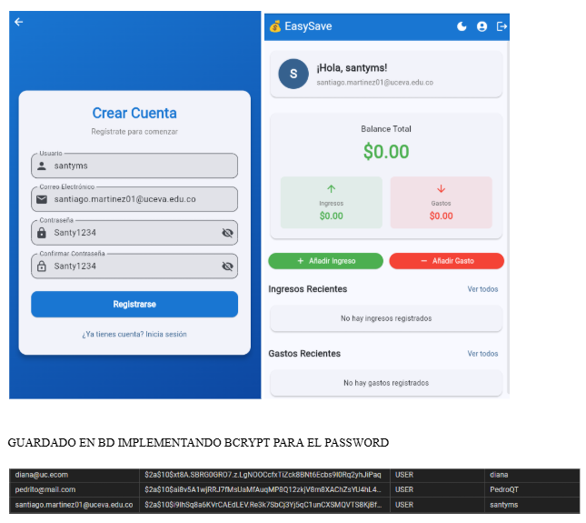
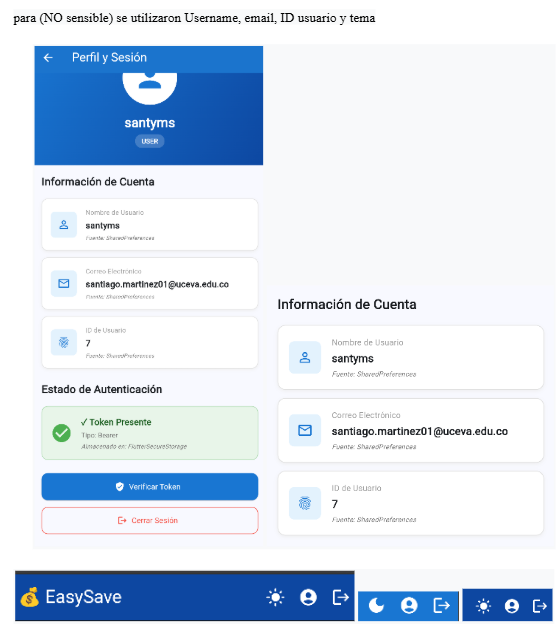
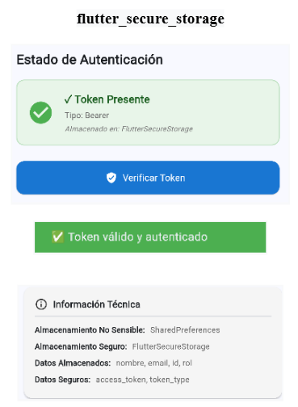
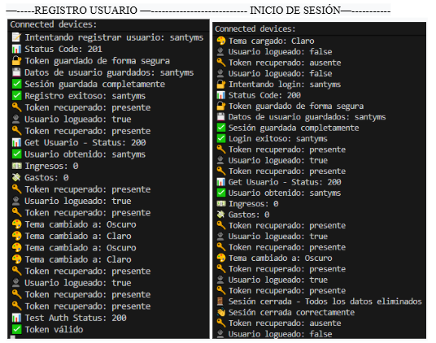

# 💰 EasySave - Gestión Financiera Personal

## 📋 Descripción del Proyecto

Aplicación Flutter desarrollada para la **gestión de ingresos y gastos personales** con autenticación JWT y almacenamiento local seguro. La app integra un sistema completo de autenticación, almacenamiento diferenciado de datos sensibles y no sensibles, tema oscuro persistente, y consumo de APIs REST de un backend Spring Boot.

Además, incluye la funcionalidad de consultar **productos de investigación** de la Facultad de Ciencias Administrativas, Económicas y Contables mediante APIs reales del sistema **MinCiencias GrupLAC**.

## 🎯 Objetivos del Proyecto

### ✅ **Sistema de Autenticación JWT**
- Implementar login y registro con JWT
- Almacenamiento seguro de tokens con `flutter_secure_storage`
- Almacenamiento de datos de usuario con `shared_preferences`
- Protección de rutas y redirección automática
- Pantalla de evidencia de almacenamiento

### ✅ **Gestión Financiera (EasySave)**
- Dashboard con resumen de ingresos y gastos
- CRUD completo para ingresos y gastos
- Clasificación por tipo (Fijo/Variable)
- Cálculo automático de balance
- Integración con backend Spring Boot

### ✅ **Almacenamiento Local Diferenciado**
- **shared_preferences** para datos NO sensibles (nombre, email, tema)
- **flutter_secure_storage** para datos sensibles (tokens JWT)
- Pantalla de evidencia mostrando fuentes de datos
- Botón de cerrar sesión que limpia todos los datos

### ✅ **Tema Oscuro Persistente**
- Toggle de tema con `Provider`
- Persistencia del tema con `shared_preferences`
- Material Design 3 (tema claro y oscuro)
- Cambio instantáneo sin reiniciar

### ✅ **Consumo de APIs mediante HTTP**
- APIs REST del backend Spring Boot (localhost:8080)
- Manejo de estados de carga, éxito y error
- Headers de autorización JWT

### ✅ **Navegación con go_router**
- Navegación moderna con rutas nombradas
- Protección de rutas según autenticación
- Redirección automática a `/easysave` después del login
- Parámetros entre pantallas

## 🔐 Sistema de Autenticación JWT

### 📡 **Backend Spring Boot**
```
Base URL: http://localhost:8080/api/v1
```

### 🔑 **Endpoints de Autenticación**
```bash
# Registro de usuario
POST /auth/register
Content-Type: application/json
{
  "username": "string",
  "correo": "string",
  "password": "string"
}

# Login
POST /auth/login
Content-Type: application/json
{
  "username": "string",
  "password": "string"
}

# Test de autenticación (protegido)
GET /auth/test
Authorization: Bearer <access_token>
```

### 📄 **Respuesta de Autenticación**
```json
{
  "access_token": "eyJhbGciOiJIUzI1NiIsInR5cCI6IkpXVCJ9...",
  "token_type": "Bearer",
  "username": "usuario123",
  "email": "usuario@example.com",
  "id": 1,
  "rol": "USER"
}
```

## 💾 Almacenamiento Local - Evidencia de Implementación

### 🔓 **Datos NO Sensibles (shared_preferences)**
Información del usuario que no requiere cifrado:

```dart
// Almacenados en shared_preferences
- username: String          // Nombre de usuario
- email: String             // Correo electrónico
- user_id: int              // ID del usuario
- rol: String               // Rol del usuario (USER, ADMIN)
- theme_mode: String        // Tema seleccionado (light/dark)
```

### 🔒 **Datos Sensibles (flutter_secure_storage)**
Tokens de autenticación cifrados:

```dart
// Almacenados en flutter_secure_storage (CIFRADO)
- access_token: String      // Token JWT de acceso
- token_type: String        // Tipo de token (Bearer)
```

### 📱 **Pantalla de Evidencia (ProfileScreen)**

La aplicación incluye una **pantalla de evidencia** que demuestra el uso diferenciado de almacenamiento:

**Ubicación:** `/profile`

**Funcionalidades:**
- ✅ Muestra nombre y email leídos desde `shared_preferences`
- ✅ Indica si hay token presente en `flutter_secure_storage`
- ✅ Muestra el tipo de token almacenado
- ✅ Diferencia visual entre datos NO sensibles y sensibles
- ✅ Botón "Cerrar Sesión" que elimina TODOS los datos

**Información mostrada:**

| Campo | Fuente | Tipo |
|-------|--------|------|
| Nombre de Usuario | `shared_preferences` | NO Sensible |
| Correo Electrónico | `shared_preferences` | NO Sensible |
| ID de Usuario | `shared_preferences` | NO Sensible |
| Rol | `shared_preferences` | NO Sensible |
| Access Token | `flutter_secure_storage` | Sensible (Oculto) |
| Token Type | `flutter_secure_storage` | Sensible |
| Estado de Sesión | Calculado | Indicador |

**Ejemplo Visual:**

```
┌─────────────────────────────────────────┐
│  👤 Perfil de Usuario                   │
├─────────────────────────────────────────┤
│                                         │
│  📦 Datos desde shared_preferences      │
│  ├─ 👤 Usuario: santiago123             │
│  ├─ 📧 Email: santiago@example.com      │
│  ├─ 🆔 ID: 1                            │
│  └─ 🎭 Rol: USER                        │
│                                         │
│  🔒 Datos desde flutter_secure_storage │
│  ├─ 🔑 Token: ✅ Presente               │
│  └─ 📝 Tipo: Bearer                     │
│                                         │
│  ℹ️ Evidencia de Almacenamiento         │
│  Los datos de usuario se almacenan en  │
│  shared_preferences (NO cifrado) y los │
│  tokens en flutter_secure_storage      │
│  (CIFRADO).                             │
│                                         │
│  [🚪 Cerrar Sesión]                     │
│                                         │
└─────────────────────────────────────────┘
```

### 🔧 **Implementación del StorageService**

```dart
class StorageService {
  // SharedPreferences para datos NO sensibles
  static const String _keyUsername = 'username';
  static const String _keyEmail = 'email';
  static const String _keyUserId = 'user_id';
  static const String _keyRol = 'rol';
  static const String _keyThemeMode = 'theme_mode';

  // FlutterSecureStorage para datos sensibles
  static const String _keyAccessToken = 'access_token';
  static const String _keyTokenType = 'token_type';

  // Guardar datos del usuario (NO sensibles)
  Future<void> saveUserData({
    required String username,
    required String email,
    required int userId,
    required String rol,
  }) async {
    final prefs = await SharedPreferences.getInstance();
    await prefs.setString(_keyUsername, username);
    await prefs.setString(_keyEmail, email);
    await prefs.setInt(_keyUserId, userId);
    await prefs.setString(_keyRol, rol);
  }

  // Guardar tokens (SENSIBLES - CIFRADO)
  Future<void> saveTokens({
    required String accessToken,
    required String tokenType,
  }) async {
    const storage = FlutterSecureStorage();
    await storage.write(key: _keyAccessToken, value: accessToken);
    await storage.write(key: _keyTokenType, value: tokenType);
  }

  // Leer datos del usuario
  Future<String?> getUsername() async {
    final prefs = await SharedPreferences.getInstance();
    return prefs.getString(_keyUsername);
  }

  // Leer token (SENSIBLE)
  Future<String?> getAccessToken() async {
    const storage = FlutterSecureStorage();
    return await storage.read(key: _keyAccessToken);
  }

  // Verificar si hay sesión activa
  Future<bool> isLoggedIn() async {
    final token = await getAccessToken();
    return token != null && token.isNotEmpty;
  }

  // Cerrar sesión - ELIMINA TODO
  Future<void> clearAll() async {
    // Limpiar shared_preferences
    final prefs = await SharedPreferences.getInstance();
    await prefs.clear();
    
    // Limpiar flutter_secure_storage
    const storage = FlutterSecureStorage();
    await storage.deleteAll();
  }
}
```

## 💰 Sistema EasySave - Gestión Financiera

### 📡 **Endpoints del Backend**

```bash
# Obtener usuario completo con ingresos y gastos
GET /usuario-service/usuarios/{id}
Authorization: Bearer <access_token>

# Listar ingresos del usuario
GET /usuario-service/usuarios/{id}/ingresos
Authorization: Bearer <access_token>

# Crear ingreso
POST /usuario-service/usuarios/{id}/ingresos
Authorization: Bearer <access_token>
Content-Type: application/json
{
  "nombreIngreso": "Salario",
  "valorIngreso": 3000000,
  "estadoIngreso": "fijo"
}

# Actualizar ingreso
PUT /usuario-service/ingresos/{id}
Authorization: Bearer <access_token>
Content-Type: application/json
{
  "nombreIngreso": "Salario Actualizado",
  "valorIngreso": 3500000,
  "estadoIngreso": "fijo"
}

# Eliminar ingreso
DELETE /usuario-service/ingresos/{id}
Authorization: Bearer <access_token>

# Endpoints similares para gastos
GET /usuario-service/usuarios/{id}/gastos
POST /usuario-service/usuarios/{id}/gastos
PUT /usuario-service/gastos/{id}
DELETE /usuario-service/gastos/{id}
```

### 📊 **Modelos de Datos**

#### Ingreso
```dart
class Ingreso {
  final int? id;
  final String nombreIngreso;
  final double valorIngreso;
  final String estadoIngreso; // 'fijo' o 'variable'

  factory Ingreso.fromJson(Map<String, dynamic> json) => Ingreso(
    id: json['id'],
    nombreIngreso: json['nombreIngreso'],
    valorIngreso: json['valorIngreso'].toDouble(),
    estadoIngreso: json['estadoIngreso'],
  );

  Map<String, dynamic> toJson() => {
    'nombreIngreso': nombreIngreso,
    'valorIngreso': valorIngreso,
    'estadoIngreso': estadoIngreso,
  };
}
```

#### Gasto
```dart
class Gasto {
  final int? id;
  final String nombreGasto;
  final double valorGasto;
  final String estadoGasto; // 'fijo' o 'variable'

  factory Gasto.fromJson(Map<String, dynamic> json) => Gasto(
    id: json['id'],
    nombreGasto: json['nombreGasto'],
    valorGasto: json['valorGasto'].toDouble(),
    estadoGasto: json['estadoGasto'],
  );

  Map<String, dynamic> toJson() => {
    'nombreGasto': nombreGasto,
    'valorGasto': valorGasto,
    'estadoGasto': estadoGasto,
  };
}
```

#### UsuarioCompleto
```dart
class UsuarioCompleto {
  final int id;
  final String username;
  final String email;
  final String rol;
  final List<Ingreso> ingresos;
  final List<Gasto> gastos;

  // Propiedades calculadas
  double get totalIngresos => ingresos.fold(0, (sum, i) => sum + i.valorIngreso);
  double get totalGastos => gastos.fold(0, (sum, g) => sum + g.valorGasto);
  double get balance => totalIngresos - totalGastos;
  
  // Filtros
  List<Ingreso> get ingresosFijos => ingresos.where((i) => i.estadoIngreso == 'fijo').toList();
  List<Ingreso> get ingresosVariables => ingresos.where((i) => i.estadoIngreso == 'variable').toList();
  List<Gasto> get gastosFijos => gastos.where((g) => g.estadoGasto == 'fijo').toList();
  List<Gasto> get gastosVariables => gastos.where((g) => g.estadoGasto == 'variable').toList();
}
```

### 📱 **Pantallas EasySave**

#### 1. **Dashboard EasySave** (`/easysave`)
**Características:**
- Saludo personalizado con nombre de usuario
- Card de resumen financiero:
  - 💵 Balance total (verde si positivo, rojo si negativo)
  - ⬆️ Total de ingresos
  - ⬇️ Total de gastos
- Botones de acción rápida (Agregar Ingreso/Gasto)
- Listas de últimos 3 ingresos y gastos
- Toggle de tema (☀️/🌙)
- Botón de perfil
- Botón de logout

#### 2. **Gestión de Ingresos** (`/easysave/ingresos`)
**Características:**
- Lista completa de ingresos con scroll
- Formulario de creación con validación:
  - Nombre del ingreso (TextFormField)
  - Valor (NumberInput con validación)
  - Tipo (Dropdown: Fijo/Variable)
- Card por ingreso mostrando:
  - Icono verde (flecha arriba)
  - Nombre y tipo con badge
  - Valor en formato moneda
  - Botón de eliminar
- Eliminación con confirmación
- Pull-to-refresh
- Estado vacío con instrucciones
- FloatingActionButton para agregar

#### 3. **Gestión de Gastos** (`/easysave/gastos`)
**Características:**
- Lista completa de gastos con scroll
- Formulario de creación con validación:
  - Nombre del gasto (TextFormField)
  - Valor (NumberInput con validación)
  - Tipo (Dropdown: Fijo/Variable)
- Card por gasto mostrando:
  - Icono rojo (flecha abajo)
  - Nombre y tipo con badge
  - Valor en formato moneda
  - Botón de eliminar
- Eliminación con confirmación
- Pull-to-refresh
- Estado vacío con instrucciones
- FloatingActionButton para agregar

#### 4. **Pantalla de Perfil/Evidencia** (`/profile`)
**Características:**
- Sección de datos NO sensibles (shared_preferences):
  - 👤 Nombre de usuario
  - 📧 Email
  - 🆔 ID de usuario
  - 🎭 Rol
- Sección de datos sensibles (flutter_secure_storage):
  - 🔑 Indicador de token presente/ausente
  - 📝 Tipo de token (Bearer)
- Card de información explicando la diferencia
- Botón "Cerrar Sesión" que:
  - Limpia shared_preferences
  - Limpia flutter_secure_storage
  - Redirige a /login

## 🏗️ Arquitectura del Proyecto

```
lib/
├── main.dart                                # Punto de entrada con Provider
├── models/
│   ├── auth_models.dart                     # RegisterRequest, LoginRequest, AuthResponse, User
│   ├── easysave_models.dart                 # Ingreso, Gasto, UsuarioCompleto
│   ├── research_product.dart                # Modelo de productos MinCiencias
│   └── product_category.dart                # Categorías de investigación
├── services/
│   ├── storage_service.dart                 # 🔐 Gestión de almacenamiento local
│   ├── auth_service.dart                    # 🔑 Autenticación JWT
│   ├── easysave_service.dart                # 💰 CRUD de ingresos/gastos
│   └── web_research_api_service.dart        # 🔬 APIs MinCiencias
├── providers/
│   └── theme_provider.dart                  # 🌓 Provider de tema oscuro
├── views/
│   ├── auth/
│   │   ├── login_screen.dart                # Pantalla de login
│   │   └── register_screen.dart             # Pantalla de registro
│   ├── profile/
│   │   └── profile_screen.dart              # 📱 Pantalla de evidencia
│   ├── easysave/
│   │   ├── easysave_screen.dart             # Dashboard financiero
│   │   ├── ingresos_screen.dart             # Gestión de ingresos
│   │   └── gastos_screen.dart               # Gestión de gastos
│   ├── home/
│   │   └── home_screen.dart                 # Pantalla principal con tabs
│   └── research/
│       ├── research_categories_screen.dart  # Categorías MinCiencias
│       ├── research_list_screen.dart        # Lista de productos
│       └── research_detail_screen.dart      # Detalle de producto
├── routes/
│   └── app_router.dart                      # 🔀 Configuración go_router
├── widgets/
│   ├── custom_navbar.dart
│   └── product_card.dart
└── themes/
    └── app_theme.dart
```

## 🛣️ Rutas Definidas con go_router

### 🔐 **Rutas Públicas**
```dart
GoRoute(
  path: '/login',
  builder: (context, state) => const LoginScreen(),
),
GoRoute(
  path: '/register',
  builder: (context, state) => const RegisterScreen(),
),
```

### 🔒 **Rutas Protegidas (requieren autenticación)**

```dart
// Dashboard principal
GoRoute(
  path: '/easysave',
  name: 'easysave',
  builder: (context, state) => const EasySaveScreen(),
),

// Gestión de ingresos
GoRoute(
  path: '/easysave/ingresos',
  name: 'ingresos',
  builder: (context, state) => const IngresosScreen(),
),

// Gestión de gastos
GoRoute(
  path: '/easysave/gastos',
  name: 'gastos',
  builder: (context, state) => const GastosScreen(),
),

// Perfil/Evidencia
GoRoute(
  path: '/profile',
  name: 'profile',
  builder: (context, state) => const ProfileScreen(),
),
```

### 🔀 **Lógica de Redirección**

```dart
redirect: (context, state) async {
  final storage = StorageService();
  final isLoggedIn = await storage.isLoggedIn();
  final isGoingToLogin = state.matchedLocation == '/login';
  final isGoingToRegister = state.matchedLocation == '/register';

  // Sin autenticación → /login
  if (!isLoggedIn && !isGoingToLogin && !isGoingToRegister) {
    return '/login';
  }

  // Con autenticación → /easysave
  if (isLoggedIn && (isGoingToLogin || isGoingToRegister)) {
    return '/easysave';
  }

  return null;
},
```

## 🎨 Tema Oscuro con Persistencia

### 🌓 **ThemeProvider**

```dart
class ThemeProvider extends ChangeNotifier {
  ThemeMode _themeMode = ThemeMode.light;
  
  ThemeMode get themeMode => _themeMode;
  bool get isDarkMode => _themeMode == ThemeMode.dark;

  ThemeProvider() {
    _loadThemeMode();
  }

  // Cargar tema guardado
  Future<void> _loadThemeMode() async {
    final prefs = await SharedPreferences.getInstance();
    final themeModeString = prefs.getString('theme_mode') ?? 'light';
    _themeMode = themeModeString == 'dark' ? ThemeMode.dark : ThemeMode.light;
    notifyListeners();
  }

  // Cambiar tema
  Future<void> toggleTheme() async {
    _themeMode = _themeMode == ThemeMode.light ? ThemeMode.dark : ThemeMode.light;
    
    // Guardar en shared_preferences
    final prefs = await SharedPreferences.getInstance();
    await prefs.setString(
      'theme_mode',
      _themeMode == ThemeMode.dark ? 'dark' : 'light',
    );
    
    notifyListeners();
  }
}
```

### 🎭 **Integración en main.dart**

```dart
void main() async {
  WidgetsFlutterBinding.ensureInitialized();
  await dotenv.load(fileName: ".env");
  runApp(const MyApp());
}

class MyApp extends StatelessWidget {
  const MyApp({super.key});

  @override
  Widget build(BuildContext context) {
    return ChangeNotifierProvider(
      create: (_) => ThemeProvider(),
      child: Consumer<ThemeProvider>(
        builder: (context, themeProvider, child) {
          return MaterialApp.router(
            title: 'EasySave - Gestión Financiera',
            debugShowCheckedModeBanner: false,
            theme: ThemeProvider.lightTheme,
            darkTheme: ThemeProvider.darkTheme,
            themeMode: themeProvider.themeMode,
            routerConfig: appRouter,
          );
        },
      ),
    );
  }
}
```

## 🔧 Dependencias del Proyecto

```yaml
dependencies:
  flutter:
    sdk: flutter
  
  # Navegación
  go_router: ^14.2.7
  
  # HTTP Client
  http: ^1.2.2
  
  # Almacenamiento
  shared_preferences: ^2.2.2        # Datos NO sensibles
  flutter_secure_storage: ^9.0.0   # Datos sensibles (tokens)
  
  # Gestión de Estado
  provider: ^6.1.1                  # State management
  
  # Utilidades
  flutter_dotenv: ^5.2.1            # Variables de entorno
  cupertino_icons: ^1.0.8           # Iconos
```

## ⚙️ Configuración del Entorno

### 📝 **Archivo .env**

```env
# Backend URL
API_BASE_URL=http://localhost:8080/api/v1

# Endpoints
AUTH_ENDPOINT=/auth
USUARIO_SERVICE_ENDPOINT=/usuario-service
```

### 🖥️ **Requisitos del Backend**

El backend Spring Boot debe estar ejecutándose en:
```
http://localhost:8080
```

**Dependencias del Backend:**
- Spring Boot 3.3.3
- Spring Security con JWT
- PostgreSQL
- JPA/Hibernate

**Base de Datos:**
```
Database: easyusuarios
Tables: usuarios, ingresos, gastos
```

## 🚀 Instalación y Ejecución

### 📋 **Requisitos**
- Flutter SDK (>=3.10.0)
- Dart (>=3.10.0)
- Backend Spring Boot ejecutándose
- Conexión a internet (APIs MinCiencias)

### 🛠️ **Instalación**

```bash
# Clonar el repositorio
git clone https://github.com/SantyMsss/mobile_development.git
cd mobile_development

# Instalar dependencias
flutter pub get

# Ejecutar en Windows (recomendado)
flutter run -d windows

# Ejecutar en modo debug
flutter run

# Analizar código
flutter analyze
```

## 🧪 Guía de Pruebas

### 1. **Probar Autenticación JWT**

**Registro:**
1. Ejecuta la app
2. Ve a "Crear cuenta"
3. Ingresa: username, email, password
4. Observa la redirección a `/easysave`
5. Verifica que aparece tu nombre en el dashboard

**Login:**
1. Cierra sesión
2. Ve a "Iniciar sesión"
3. Ingresa credenciales
4. Observa la redirección a `/easysave`

**Cerrar Sesión:**
1. Ve a Perfil
2. Toca "Cerrar Sesión"
3. Verifica redirección a `/login`
4. Intenta acceder a `/easysave` → debe redirigir a login

### 2. **Probar Almacenamiento Diferenciado**

**Verificar shared_preferences:**
1. Inicia sesión
2. Ve a Perfil (`/profile`)
3. Observa los datos mostrados:
   - ✅ Username desde shared_preferences
   - ✅ Email desde shared_preferences
   - ✅ ID desde shared_preferences
   - ✅ Rol desde shared_preferences

**Verificar flutter_secure_storage:**
1. En Perfil, busca la sección "Datos Sensibles"
2. Verifica:
   - ✅ Indicador de token presente
   - ✅ Tipo de token (Bearer)

**Verificar limpieza completa:**
1. Cierra sesión
2. Abre el almacenamiento del dispositivo
3. Verifica que NO haya datos de sesión
4. Intenta acceder a rutas protegidas → redirección a login

### 3. **Probar Gestión de Ingresos**

1. Inicia sesión → Dashboard
2. Toca "Ver Todos" en Ingresos
3. Toca el botón flotante "+"
4. Completa el formulario:
   - Nombre: "Salario"
   - Valor: 3000000
   - Tipo: Fijo
5. Observa el ingreso en la lista
6. Verifica el total en el dashboard
7. Elimina el ingreso (confirmación)

### 4. **Probar Gestión de Gastos**

1. Desde dashboard, toca "Ver Todos" en Gastos
2. Toca el botón flotante "+"
3. Completa el formulario:
   - Nombre: "Arriendo"
   - Valor: 800000
   - Tipo: Fijo
4. Observa el gasto en la lista
5. Verifica el total en el dashboard
6. Verifica el balance (Ingresos - Gastos)

### 5. **Probar Tema Oscuro**

1. En el dashboard, toca el icono ☀️
2. Observa el cambio instantáneo a tema oscuro 🌙
3. Navega entre pantallas → tema persiste
4. Cierra la app completamente
5. Abre la app nuevamente
6. Verifica que el tema sigue siendo oscuro
7. Cambia a tema claro ☀️
8. Repite el proceso

### 6. **Probar APIs MinCiencias**

1. Ve a Home (`/`)
2. Selecciona tab "Investigación"
3. Toca "Artículos Tipo I"
4. Observa loading → lista de productos
5. Toca un producto
6. Verifica detalles completos
7. Usa el botón "Atrás"

## 📊 Flujos de Usuario

### 🔐 **Flujo de Autenticación**

```
Inicio → /login
         │
         ├─ Registro exitoso → /easysave (Dashboard)
         ├─ Login exitoso → /easysave (Dashboard)
         └─ Error → Mensaje + Reintento
```

### 💰 **Flujo EasySave**

```
/easysave (Dashboard)
    │
    ├─ Ver Ingresos → /easysave/ingresos
    │       ├─ Agregar Ingreso
    │       └─ Eliminar Ingreso
    │
    ├─ Ver Gastos → /easysave/gastos
    │       ├─ Agregar Gasto
    │       └─ Eliminar Gasto
    │
    ├─ Perfil → /profile
    │       ├─ Ver evidencia de almacenamiento
    │       └─ Cerrar Sesión → /login
    │
    └─ Toggle Tema → Cambio instantáneo + persistencia
```

### 🔬 **Flujo de Investigación**

```
/research (Categorías)
    │
    ├─ ART_I → /research/ART_I
    ├─ ART_E → /research/ART_E
    ├─ LIB → /research/LIB
    └─ CAP_LIB → /research/CAP_LIB
            │
            └─ Producto → /research/{category}/{id}
```

## 🔍 Logs y Debugging

### 📊 **Logs de Autenticación**
```
🔐 Iniciando login para usuario: santiago123
✅ Login exitoso - Token recibido
💾 Guardando datos en shared_preferences: username, email, id, rol
🔒 Guardando tokens en flutter_secure_storage (CIFRADO)
🔀 Redirigiendo a /easysave
```

### 💰 **Logs de EasySave**
```
📊 Obteniendo datos del usuario ID: 1
✅ Usuario obtenido: 5 ingresos, 3 gastos
💵 Balance calculado: $1,200,000
📈 Total ingresos: $3,000,000
📉 Total gastos: $1,800,000
```

### 🌓 **Logs de Tema**
```
🎨 Tema actual: light
🔄 Cambiando tema a: dark
💾 Guardando preferencia en shared_preferences
✨ Tema aplicado exitosamente
```

### 🚪 **Logs de Logout**
```
🚪 Cerrando sesión
🧹 Limpiando shared_preferences
🔒 Limpiando flutter_secure_storage
✅ Sesión cerrada exitosamente
🔀 Redirigiendo a /login
```

## 📸 Capturas de Pantalla

### 🔐 **Autenticación**

| Login | Registro |
|-------|----------|
| Formulario de inicio de sesión con validación | Formulario de registro con confirmación de contraseña |

### 💰 **EasySave Dashboard**

| Dashboard Claro | Dashboard Oscuro |
|----------------|------------------|
| Vista de resumen financiero con tema claro | Vista de resumen financiero con tema oscuro |

### 📊 **Gestión Financiera**

| Ingresos | Gastos |
|----------|--------|
| Lista de ingresos con CRUD | Lista de gastos con CRUD |

### 👤 **Pantalla de Evidencia**

| Perfil/Evidencia |
|------------------|
| Demostración de almacenamiento diferenciado: shared_preferences (nombre, email) + flutter_secure_storage (tokens) |

## 🎯 Cumplimiento de Requisitos

### ✅ **Autenticación JWT**
- ✅ Login y registro implementados
- ✅ Tokens JWT almacenados de forma segura
- ✅ Headers de autorización en requests
- ✅ Redirección automática según estado de autenticación

### ✅ **Almacenamiento Local Diferenciado**
- ✅ `shared_preferences` para datos NO sensibles:
  - username, email, user_id, rol, theme_mode
- ✅ `flutter_secure_storage` para datos sensibles:
  - access_token, token_type (CIFRADO)
- ✅ Pantalla de evidencia (`/profile`) mostrando:
  - Datos de shared_preferences
  - Indicador de tokens en flutter_secure_storage
  - Diferenciación visual clara
  - Botón de cerrar sesión que limpia TODO

### ✅ **Gestión Financiera**
- ✅ CRUD completo de ingresos
- ✅ CRUD completo de gastos
- ✅ Dashboard con resumen y balance
- ✅ Clasificación por tipo (Fijo/Variable)
- ✅ Validación de formularios

### ✅ **Tema Oscuro Persistente**
- ✅ Provider para gestión de estado
- ✅ Persistencia con shared_preferences
- ✅ Toggle en AppBar de pantallas principales
- ✅ Temas Material Design 3

### ✅ **Navegación y Protección**
- ✅ go_router con rutas nombradas
- ✅ Protección de rutas según autenticación
- ✅ Redirección automática
- ✅ Path y query parameters

## 👨‍💻 Desarrollador

**Santiago Martinez Serna**  
🎓 Ingeniería de Sistemas  
🏫 Unidad Central del Valle
📚 Desarrollo Móvil - 7° Semestre  
📅 Octubre 2025

## 📝 Notas Técnicas

### 🔒 **Seguridad**
- Los tokens JWT se almacenan **cifrados** en flutter_secure_storage
- Las credenciales NO se guardan, solo los tokens
- Validación de formularios en cliente y servidor
- Headers de autorización en todas las peticiones protegidas

### 🎨 **UI/UX**
- Material Design 3 con colores personalizados
- Feedback visual para todas las acciones
- Estados de loading, éxito y error
- Confirmaciones antes de eliminar
- Pull-to-refresh en listas

### 🧪 **Testing**
- Validar almacenamiento en shared_preferences
- Validar cifrado en flutter_secure_storage
- Probar flujo completo de autenticación
- Verificar limpieza al cerrar sesión
- Validar persistencia de tema

---

## 📸 Evidencias de Implementación

### 🔐 **Sistema de Autenticación JWT**

La siguiente imagen muestra la implementación completa del sistema de autenticación con JWT en Flutter, incluyendo las pantallas de login, registro y la integración con el backend Spring Boot:



*Sistema completo de autenticación: Login, Registro, Dashboard EasySave y flujo de redirección automática.*

---

### 📦 **Almacenamiento con shared_preferences**

Evidencia del uso de `shared_preferences` para almacenar datos **NO sensibles** del usuario. Los datos almacenados incluyen:
- Username
- Email
- User ID
- Rol
- Theme Mode



*Datos NO sensibles almacenados en shared_preferences: información del perfil de usuario visible en la pantalla de evidencia.*

---

### 🔒 **Almacenamiento Seguro con flutter_secure_storage**

Evidencia del uso de `flutter_secure_storage` para almacenar datos **SENSIBLES** de forma cifrada. Los tokens JWT se almacenan de manera segura:
- Access Token (JWT)
- Token Type (Bearer)



*Datos SENSIBLES almacenados de forma CIFRADA: tokens JWT protegidos en flutter_secure_storage.*

---

### 🖥️ **Logs de Consola e Indicadores de Sesión**

Logs generales del sistema mostrando:
- Proceso de autenticación
- Almacenamiento de datos
- Indicadores de sesión activa
- Redirección según estado de autenticación
- Operaciones CRUD de ingresos y gastos



*Logs de debugging mostrando el flujo completo de autenticación, almacenamiento y operaciones del sistema EasySave.*

---

## 📊 Resumen de Implementación

### ✅ **Diferenciación de Almacenamiento**

| Tipo de Dato | Storage Utilizado | Cifrado | Datos Almacenados |
|--------------|-------------------|---------|-------------------|
| **NO Sensibles** | `shared_preferences` | ❌ NO | username, email, user_id, rol, theme_mode |
| **SENSIBLES** | `flutter_secure_storage` | ✅ SÍ | access_token, token_type |

### 🎯 **Validación de Requisitos**

✅ **Pantalla de Evidencia (`/profile`):**
- Muestra nombre y email desde `shared_preferences`
- Indica presencia de token desde `flutter_secure_storage`
- Diferenciación visual clara entre datos sensibles y no sensibles
- Botón "Cerrar Sesión" que elimina TODOS los datos

✅ **Almacenamiento Correcto:**
- Datos del usuario en `shared_preferences` (NO cifrado)
- Tokens JWT en `flutter_secure_storage` (CIFRADO)
- Limpieza completa al cerrar sesión

---

**📊 Estado del Proyecto**: ✅ COMPLETADO  
**🔐 Autenticación JWT**: ✅ IMPLEMENTADO  
**💾 Almacenamiento Diferenciado**: ✅ IMPLEMENTADO  
**💰 EasySave**: ✅ IMPLEMENTADO  
**🌓 Tema Oscuro Persistente**: ✅ IMPLEMENTADO  
**📱 Pantalla de Evidencia**: ✅ IMPLEMENTADO  

---

**📅 Fecha de Desarrollo**: Octubre 2025  
**🏫 Institución**: Unidad Central del Valle (UCEVA)  
**📚 Materia**: Desarrollo Móvil  
**🎯 Proyecto**: Sistema de Gestión Financiera con JWT y Almacenamiento Seguro
