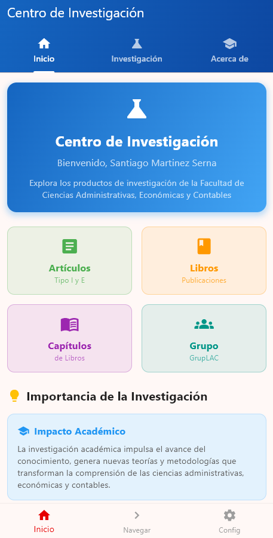
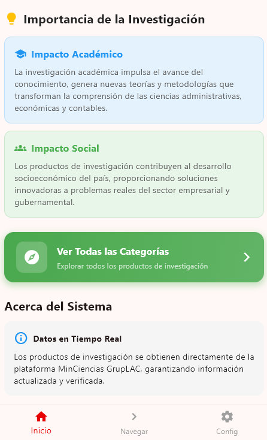
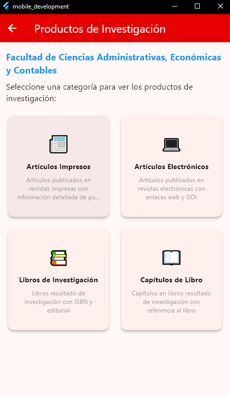
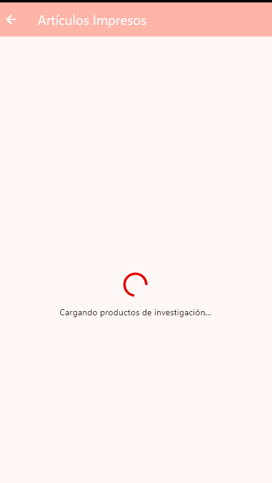
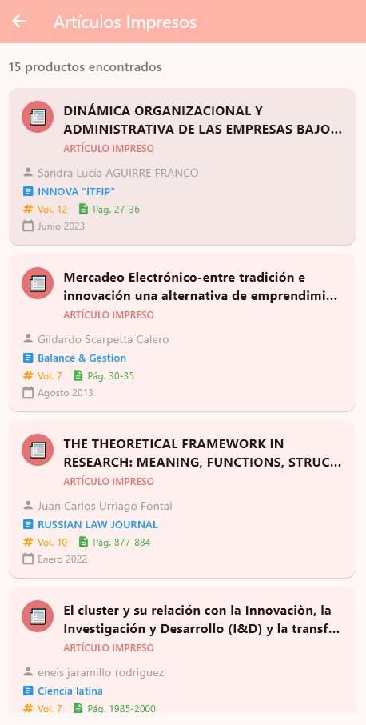
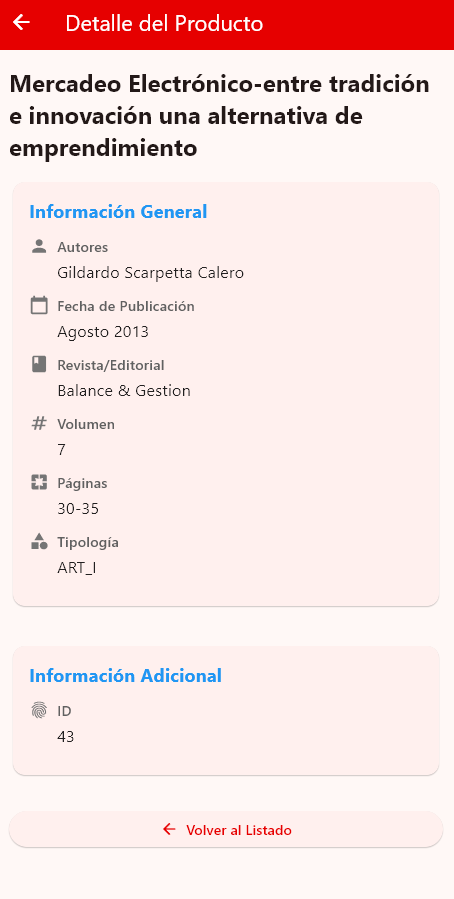
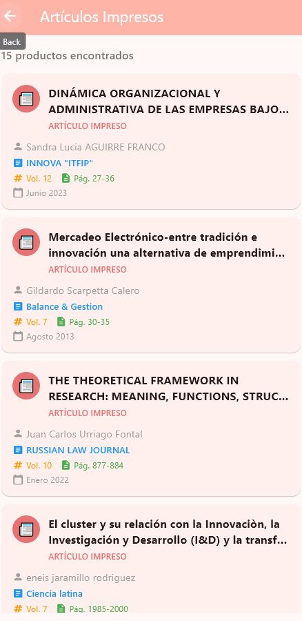
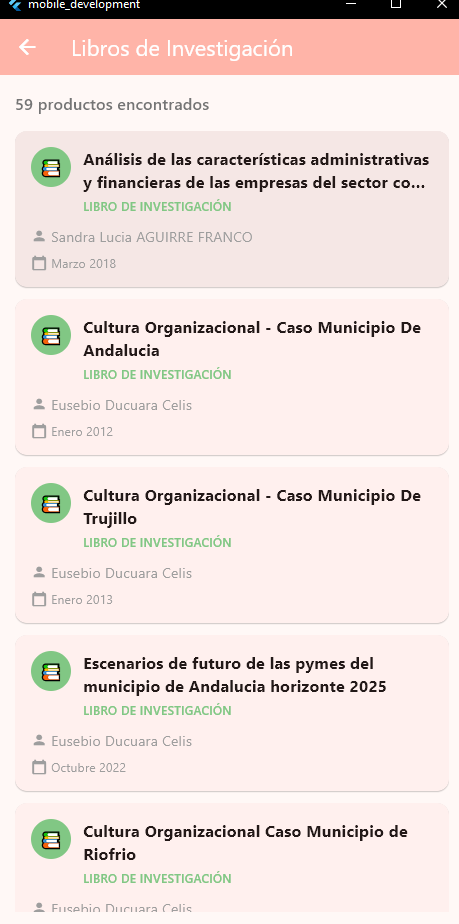
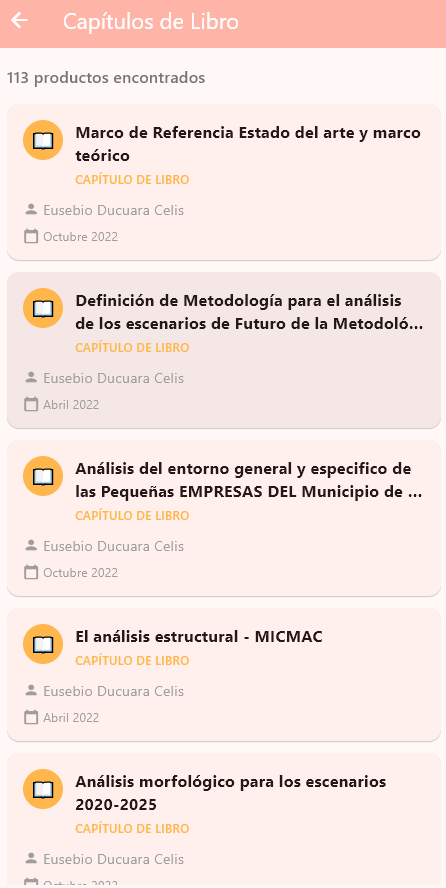
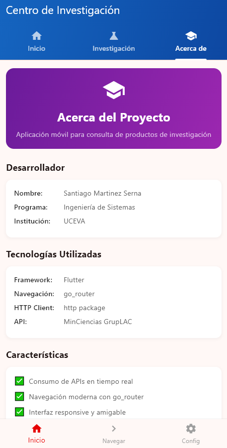

#  Centro de Investigación - App Flutter

## 📦 Publicación y Distribución de la App

### 🔄 **Flujo de Distribución Completo**

```
📱 Generar APK → 🚀 App Distribution → 👥 Testers → 📲 Instalación → 🔄 Actualización
```

#### **1. Generar APK** 📱
```bash
# Generar APK de producción (release)
flutter build apk --release

# Ubicación del APK generado
build/app/outputs/flutter-apk/app-release.apk
```

#### **2. Firebase App Distribution** 🚀
1. Accede a [Firebase Console](https://console.firebase.google.com/)
2. Selecciona tu proyecto
3. Ve a **App Distribution** en el menú lateral
4. Sube el APK (`app-release.apk`)
5. Agrega **Release Notes** (ver sección de versionado)
6. Invita a testers por correo electrónico

#### **3. Testers** 👥
Los testers recibirán:
- 📧 Email de invitación de Firebase
- 🔗 Link para descargar la app
https://appdistribution.firebase.google.com/testerapps/1:579562761429:android:686bdba7a0505efc42465c/releases/4bta2qs5vd7tg?utm_source=firebase-console
- 📱 Instrucciones de instalación

#### **4. Instalación** 📲
**En dispositivo Android:**
1. Descarga el APK desde el link de Firebase
2. Habilita instalación de fuentes desconocidas (si es necesario)
3. Instala la aplicación
4. Abre y prueba las funcionalidades

#### **5. Actualización** 🔄
Cuando publicas una nueva versión:
- Los testers reciben notificación automática
- Pueden descargar e instalar la actualización
- Android detecta la nueva versión por `versionCode`

---

### 📊 **Versionado Semántico (Semantic Versioning)**

Este proyecto sigue el estándar **Semantic Versioning 2.0.0** ([semver.org](https://semver.org/)):

#### **Formato de Versión**
```
MAJOR.MINOR.PATCH

Ejemplo: 1.1.0
  ↑   ↑  ↑
  |   |  └─ PATCH: Correcciones de bugs (1.0.1, 1.0.2)
  |   └──── MINOR: Nuevas funcionalidades compatibles (1.1.0, 1.2.0)
  └──────── MAJOR: Cambios que rompen compatibilidad (2.0.0, 3.0.0)
```

#### **Configuración en `android/app/build.gradle.kts`**
```kotlin
defaultConfig {
    applicationId = "com.example.inv_mobile"
    
    // versionCode: Número interno para Android (MMMNNNOOO)
    // Formato: 1000001 = v1.0.0, 1010001 = v1.1.0, 2000001 = v2.0.0
    versionCode = 1010001
    
    // versionName: Versión visible para usuarios
    versionName = "1.1.0"
}
```

#### **Reglas de Incremento**

| Tipo de Cambio | versionCode | versionName | Ejemplo |
|----------------|-------------|-------------|---------|
| 🐛 **Bug fix** | +1 | x.x.PATCH+1 | 1000001 → 1000002 (1.0.0 → 1.0.1) |
| ✨ **Nueva funcionalidad** | +10000 | x.MINOR+1.0 | 1000001 → 1010001 (1.0.0 → 1.1.0) |
| 💥 **Cambio incompatible** | +1000000 | MAJOR+1.0.0 | 1000001 → 2000001 (1.0.0 → 2.0.0) |

---

### 📝 **Formato de Release Notes**

Cada versión debe incluir notas de lanzamiento claras y concisas:

#### **Plantilla de Release Notes**
```markdown
## Versión X.Y.Z - [Mes] [Año]

### ✨ Novedades
- [Descripción de nuevas funcionalidades]

### 🐛 Correcciones
- [Bugs corregidos]

### 🔧 Mejoras
- [Optimizaciones y mejoras de rendimiento]

### ⚠️ Cambios Importantes
- [Cambios que afectan el uso de la app]
```

#### **Ejemplo Real - v1.1.0**
```markdown
## Versión 1.1.0 - Octubre 2025

### ✨ Novedades
- 🏭 **Prototipo Industrial**: Nueva categoría para consultar prototipos industriales
- 💡 **Innovaciones Empresariales**: Nueva categoría de innovaciones en gestión

### 🔧 Mejoras
- Catálogo ampliado de 4 a 6 categorías de investigación
- Integración completa con APIs adicionales de MinCiencias
- Interfaz de usuario mantenida para navegación intuitiva

### 📊 Categorías Disponibles
1. 📰 Artículos Impresos
2. 💻 Artículos Electrónicos
3. 📚 Libros
4. 📖 Capítulos de Libro
5. 🏭 Prototipo Industrial ⭐ NUEVO
6. 💡 Innovaciones Empresariales ⭐ NUEVO
```

---

### 🔧 **Configuración Android para Distribución**

#### **1. Permisos en `AndroidManifest.xml`**
```xml
<uses-permission android:name="android.permission.INTERNET"/>
<uses-permission android:name="android.permission.ACCESS_NETWORK_STATE"/>
<uses-permission android:name="android.permission.ACCESS_WIFI_STATE"/>
<uses-permission android:name="android.permission.CHANGE_NETWORK_STATE"/>
```

#### **2. Logo de la Aplicación**
Logo generado en 5 resoluciones:
- `mipmap-mdpi/ic_launcher.png` (48x48px)
- `mipmap-hdpi/ic_launcher.png` (72x72px)
- `mipmap-xhdpi/ic_launcher.png` (96x96px)
- `mipmap-xxhdpi/ic_launcher.png` (144x144px)
- `mipmap-xxxhdpi/ic_launcher.png` (192x192px)

#### **3. Firebase Configuration**
```kotlin
// android/build.gradle.kts
plugins {
    id("com.google.gms.google-services") version "4.4.4" apply false
}

// android/app/build.gradle.kts
plugins {
    id("com.google.gms.google-services")
}
```

Archivo `google-services.json` ubicado en: `android/app/`

---

### 👥 **Replicar el Proceso en el Equipo**

#### **Paso 1: Configuración Inicial**
```bash
# 1. Clonar el repositorio
git clone https://github.com/SantyMsss/mobile_development.git
cd mobile_development

# 2. Instalar dependencias
flutter pub get

# 3. Verificar configuración de Flutter
flutter doctor
```

#### **Paso 2: Preparar Nueva Versión**
```bash
# 1. Crear rama para nueva versión
git checkout -b feature/version-x.y.z

# 2. Actualizar versionado en android/app/build.gradle.kts
# - Incrementar versionCode según tipo de cambio
# - Actualizar versionName siguiendo semver

# 3. Escribir Release Notes
# - Documentar cambios en archivo CHANGELOG.md o README.md
```

#### **Paso 3: Generar y Probar APK**
```bash
# 1. Limpiar build anterior (opcional)
flutter clean
flutter pub get

# 2. Generar APK de release
flutter build apk --release

# 3. Verificar APK generado
# Ubicación: build/app/outputs/flutter-apk/app-release.apk
# Tamaño: ~46 MB

# 4. Probar en dispositivo físico (recomendado)
# Instalar manualmente y validar funcionalidades
```

#### **Paso 4: Publicar en Firebase App Distribution**
```bash
# Opción A: Interfaz Web de Firebase
1. Acceder a Firebase Console
2. Seleccionar proyecto "mobile_development"
3. Ir a App Distribution
4. Subir app-release.apk
5. Agregar Release Notes
6. Seleccionar grupos de testers
7. Publicar

# Opción B: Firebase CLI (automatizado)
firebase appdistribution:distribute \
  build/app/outputs/flutter-apk/app-release.apk \
  --app YOUR_FIREBASE_APP_ID \
  --groups "qa-team, beta-testers" \
  --release-notes "Release notes aquí"
```

#### **Paso 5: Notificar al Equipo**
```markdown
📧 Email Template:

Asunto: Nueva Versión X.Y.Z Disponible - [Nombre App]

Hola equipo,

Se ha publicado una nueva versión de la aplicación:

📱 **Versión**: X.Y.Z
📅 **Fecha**: [Fecha]
🔗 **Descargar**: [Link Firebase App Distribution]

### Novedades:
- [Lista de cambios principales]

### Instrucciones:
1. Accede al link de descarga
2. Instala la actualización
3. Reporta cualquier issue encontrado

¡Gracias por probar!
```

#### **Paso 6: Merge y Tag**
```bash
# 1. Hacer commit de cambios
git add .
git commit -m "chore: bump version to X.Y.Z"

# 2. Crear tag de versión
git tag -a vX.Y.Z -m "Release vX.Y.Z - [Descripción breve]"

# 3. Push a repositorio
git push origin feature/version-x.y.z
git push origin vX.Y.Z

# 4. Crear Pull Request y merge a main
```

---

### 📋 **Checklist de Release**

Antes de publicar una nueva versión, verifica:

- [ ] ✅ `versionCode` incrementado correctamente
- [ ] ✅ `versionName` actualizado siguiendo semver
- [ ] ✅ Release Notes escritas y claras
- [ ] ✅ APK generado en modo `--release`
- [ ] ✅ APK probado en dispositivo físico
- [ ] ✅ Funcionalidades principales testeadas
- [ ] ✅ Sin errores en `flutter analyze`
- [ ] ✅ Firebase App Distribution configurado
- [ ] ✅ Testers agregados a grupos
- [ ] ✅ Tag de versión creado en Git
- [ ] ✅ Documentación actualizada (README.md)

---

## ⚙️ Instalación y Ejecución

### 📋 **Requisitos**
- Flutter SDK (>=3.10.0)
- Dart (>=3.10.0)
- Conexión a internet (APIs reales)
- Android SDK (para compilar APK)

### 🚀 **Dependencias**
```yaml
dependencies:
  flutter:
    sdk: flutter
  go_router: ^14.8.1          # Navegación moderna
  http: ^1.1.0                # Cliente HTTP
  flutter_dotenv: ^5.2.1      # Variables de entorno
  cupertino_icons: ^1.0.8     # Iconos iOS
```

### 📱 **Ejecución**
```bash
# Clonar el repositorio
git clone https://github.com/SantyMsss/mobile_development.git
cd mobile_development

# Instalar dependencias
flutter pub get

# Ejecutar en Windows (recomendado para evitar CORS)
flutter run -d windows

# Ejecutar en dispositivo Android
flutter run

# Generar APK de producción
flutter build apk --release

# Analizar código
flutter analyze
```

## 🧪 Guía de Pruebas

### 1. **Probar Consumo de APIs**
1. Ejecuta `flutter run -d windows`
2. Ve a la pestaña "Investigación"
3. Selecciona "Artículos Tipo I"
4. Observa el loading y luego la lista de 15 productos
5. Toca cualquier producto para ver el detalle

### 2. **Verificar Navegación go_router**
1. Desde Home, toca "Ver Todas las Categorías"
2. Selecciona cualquier categoría (ART_I, ART_E, etc.)
3. Verifica la URL en la barra de navegación
4. Toca un producto para ir al detalle
5. Usa el botón "Atrás" del AppBar

### 3. **Probar Estados de Error**
1. Desconecta internet momentáneamente
2. Intenta cargar una categoría
3. Observa el mensaje de error
4. Reconecta internet y toca "Reintentar"

### 4. **Validar Responsive Design**
1. Cambia el tamaño de la ventana (Windows)
2. Verifica que la UI se adapte correctamente
3. Prueba en diferentes resoluciones

## 🔍 Logs y Debugging

### 📊 **Logs de API en Consola**
```
🌐 [MÓVIL] URL directa: https://scienti.minciencias.gov.co/gruplac/json/...
📊 Status Code: 200
📦 Content-Type: application/json;charset=UTF-8
📝 Response Length: 8858 caracteres
📋 Respuesta es una List directa con 15 elementos
🎉 15 productos procesados exitosamente para tipología: ART_I
```

### ❌ **Logs de Error**
```
📊 Status Code: 500
📦 Content-Type: text/html;charset=UTF-8
❌ Error HTTP 500: Error Interno del Servidor
```

### 🔍 **Logs de Navegación**
```
🔍 Buscando producto con ID: 185 en tipología: ART_I
✅ Producto encontrado: DINÁMICA ORGANIZACIONAL Y ADMINISTRATIVA...
```

## 📊 Tecnologías Utilizadas

- **Flutter** (>=3.10.0) - Framework multiplataforma
- **Dart** (>=3.10.0) - Lenguaje de programación
- **go_router** (^14.2.7) - Navegación declarativa moderna
- **http** (^1.1.0) - Cliente HTTP para APIs
- **flutter_dotenv** (^5.1.0) - Gestión de variables de entorno
- **Material Design 3** - Sistema de diseño de Google

## 🎨 Características de UI/UX

### 🎭 **Diseño**
- **Material Design 3** con tema profesional
- **Gradientes** específicos por categoría de investigación
- **Cards** con sombras y border radius
- **Iconografía** científica coherente
- **Paleta de colores** institucional

### 🧭 **Navegación**
- **go_router** para navegación declarativa
- **Path parameters** para IDs de categoría y producto
- **Query parameters** para metadatos adicionales
- **AppBar** automático con botón "Atrás"
- **Breadcrumb** implícito en la navegación

### 📱 **Responsive**
- **Adaptive** para diferentes tamaños de pantalla
- **GridView** responsive en home
- **ListView** optimizado para móvil
- **Padding** y spacing consistentes

## 👨‍💻 Desarrollador

**Santiago Martinez Serna**  
🎓 Ingeniería de Sistemas  
🏫 Unidad Central del valle  
📚 Desarrollo Móvil - 7° Semestre  
📅 Octubre 2025

## 📸 Capturas de Pantalla

### 🏠 **Pantalla Principal (Home)**
La interfaz principal con tabs organizados y contenido educativo sobre investigación.

| Inicio | Investigación |
|--------|---------------|
|  |  |

### 🔬 **Exploración de Productos de Investigación**
Navegación hacia las categorías disponibles desde el menú principal.

| Categorías de Investigación |
|----------------------------|
|  |

### ⏳ **Estados de Carga**
Indicadores de progreso mientras se consumen las APIs de MinCiencias.

| Estado Loading |
|----------------|
|  |

### 📋 **Listados por Categoría**
ListView.builder dinámico con productos organizados por tipología.

| Lista de Productos |
|-------------------|
|  |

### 📄 **Detalle de Producto**
Información completa del producto seleccionado obtenida directamente de la API.

| Vista Detalle |
|---------------|
|  |

### 🔍 **Logs de Consola**
Registro del consumo exitoso de APIs con datos reales de MinCiencias.

| Logs de Desarrollo |
|-------------------|
|  |

### 📊 **Productos por Tipología**
Diferentes categorías de productos de investigación disponibles.

#### 📑 **Artículos Tipo I** (Revistas Especializadas)
| Artículos Impresos |
|-------------------|
|  |

#### 📄 **Artículos Tipo E** (Otras Publicaciones)
| Artículos Digitales |
|--------------------|
|  |

#### 📚 **Libros de Investigación**
| Publicaciones Académicas |
|-------------------------|
|  |

#### 📖 **Capítulos de Libros**
| Capítulos Académicos |
|---------------------|
|  |

### ℹ️ **Información del Proyecto**
Pantalla con detalles sobre el desarrollo y objetivos del taller.

| Acerca De |
|-----------|
|  |

---

> **📱 Nota**: Todas las imágenes muestran la aplicación funcionando con **datos reales** de las APIs de MinCiencias GrupLAC, sin uso de datos mock.
## 🎯 Cumplimiento de Requisitos del Taller

### ✅ **1. Consumo de APIs mediante HTTP**
- ✅ Paquete `http` implementado
- ✅ APIs reales MinCiencias (NO mock)
- ✅ ListView.builder con datos dinámicos
- ✅ Manejo de estados loading/success/error

### ✅ **2. Navegación con go_router**
- ✅ Rutas nombradas configuradas
- ✅ Path parameters (categoryId, productId)
- ✅ Query parameters (apiEndpoint)
- ✅ Navegación lista → detalle

### ✅ **3. Manejo de Estado y Validaciones**
- ✅ Estados de loading con CircularProgressIndicator
- ✅ Try/catch para manejo de errores
- ✅ Validaciones null-safety
- ✅ SnackBar con opciones de reintento

### ✅ **4. Buenas Prácticas y Arquitectura**
- ✅ Separación en carpetas (models/, services/, views/)
- ✅ Null-safety habilitado
- ✅ Código documentado
- ✅ Manejo robusto de errores

---

## 📚 Historial de Versiones

### **v1.1.0** - 19 de Octubre 2025 ⭐ ACTUAL
- ✨ Agregadas 2 nuevas categorías de investigación (PI e IG)
- 🔧 Catálogo ampliado de 4 a 6 categorías
- � APK de producción: 46.0 MB
- 🔢 versionCode: 1010001

### **v1.0.0** - Octubre 2025
- 🎉 Release inicial
- 📱 4 categorías de investigación (ART_I, ART_E, LIB, CAP_LIB)
- 🗺️ Navegación con go_router
- 🌐 Consumo de APIs MinCiencias
- 🎨 Interfaz Material Design 3
- 🔢 versionCode: 1000001

---

**�📊 Estado**: ✅ COMPLETADO AL 100%  
**🎯 APIs**: ✅ FUNCIONANDO (6 categorías disponibles)  
**🗺️ Navegación**: ✅ go_router IMPLEMENTADO  
**📱 UI/UX**: ✅ RESPONSIVE Y PROFESIONAL  
**📦 Distribución**: ✅ CONFIGURADO PARA ANDROID  
**🔄 Versionado**: ✅ SEMANTIC VERSIONING  

---

**📅 Fecha de Desarrollo**: Octubre 2025  
**🏫 Institución**: Unidad Central del valle (UCEVA)  
**📚 Materia**: Desarrollo Móvil - 7° Semestre  
**🎯 Proyecto**: Taller Consumo de APIs y Distribución de Apps Flutter  
**📦 Versión Actual**: 1.1.0 (Build 1010001)
