# 🚴‍♂️ Mundial de Ciclismo 2024 - App Flutter

## 📋 Descripción del Proyecto

Aplicación Flutter desarrollada para demostrar **procesamiento en segundo plano** con enfoque en ciclismo mundial. La app implementa Future/async/await, Timer e Isolate para simular análisis de datos ciclistas, cronometraje y procesamiento pesado de información del Mundial de Ciclismo 2024.

## 🎯 Objetivos del Taller

### ✅ **Future / async / await**
- Demostrar asincronía para carga de datos de ciclistas
- Implementar estados de carga y manejo de errores
- Simular obtención de datos desde servidor

### ✅ **Timer**
- Cronómetro preciso para entrenamientos ciclistas
- Control completo: iniciar, pausar, reanudar y resetear
- Actualización en tiempo real cada 100ms

### ✅ **Isolate**
- Procesamiento pesado de análisis ciclistas sin bloquear UI
- Comunicación entre hilos principal y worker
- Compatibilidad multiplataforma (native + web)

## 🏗️ Arquitectura del Proyecto

```
lib/
├── main.dart                    # Configuración de la app y router
├── routes/
│   └── app_router.dart         # Configuración de rutas con Go Router
├── views/
│   ├── home/
│   │   └── home_screen.dart    # Pantalla principal con drawer
│   ├── future/
│   │   └── future_view.dart    # Demostración Future/async/await
│   ├── timer/
│   │   └── timer_view.dart     # Cronómetro con Timer.periodic
│   └── isolate/
│       └── isolate_view.dart   # Procesamiento pesado con Isolate
├── widgets/
│   ├── cycling_drawer.dart     # Menú lateral temático
│   └── base_view.dart          # Vista base con drawer
└── themes/
    └── app_theme.dart          # Tema de la aplicación
```

## 🚀 Funcionalidades Implementadas

### 🏠 **Pantalla Principal (HomeScreen)**
- Mensaje inspiracional sobre la pasión por el ciclismo
- Navegación via menú lateral (Drawer)
- Acceso directo a todas las funcionalidades

### � **Future View (Asincronía)**
- Carga asíncrona de datos de ciclistas profesionales
- Estados de UI: loading, success, error
- Simulación de conexión a servidor (2-3 segundos)

### ⏱️ **Timer View (Cronómetro)**
- Cronómetro de precisión para entrenamientos
- Controles: Iniciar, Pausar, Reanudar, Resetear
- Actualización cada 100ms

### �️ **Isolate View (Procesamiento Pesado)**
- Análisis de 50,000 puntos de datos ciclistas
- Comunicación bidireccional con worker thread
- Compatibilidad web (compute) y nativa (Isolate.spawn)

## 🧪 Guía de Pruebas

### 1. **Probar Future/async/await**
1. Ve a "Future View" desde el drawer
2. Observa el estado de loading inicial
3. Espera 2-3 segundos para ver los datos cargados
4. Verifica el manejo de errores si falla la conexión

### 2. **Probar Timer (Cronómetro)**
1. Ve a "Timer View" desde el drawer
2. Presiona "Iniciar" y observa el cronómetro
3. Prueba "Pausar" y "Reanudar"
4. Usa "Resetear" para volver a 00:00:00

### 3. **Probar Isolate (Procesamiento Pesado)**
1. Ve a "Isolate View" desde el drawer
2. Presiona "Procesar Datos Pesados"
3. Observa que la UI no se bloquea durante el procesamiento
4. Ve el resultado del análisis de 50,000 datos

## 📸 Demostración del Taller - Procesamiento en Segundo Plano

### 🏠 **Pantalla Principal - Opciones del Drawer**
| Menú Principal |
|:---:|
| 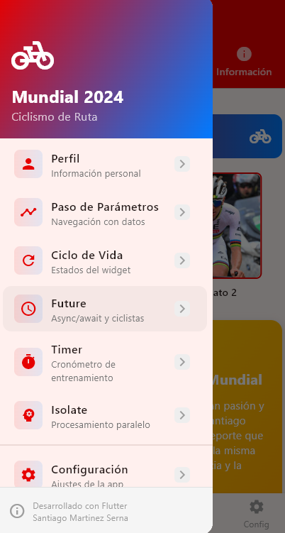 |
| **� Menú lateral con acceso a todas las funcionalidades** |

### 🔮 **1. Future / async / await - Carga Asíncrona de Datos**

| Estado de Carga | Datos Cargados | Logs en Consola |
|:---:|:---:|:---:|
| 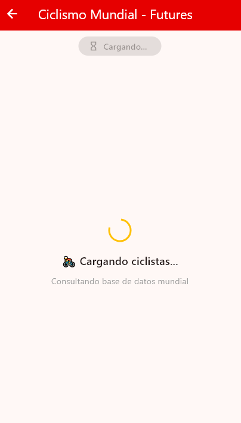 | 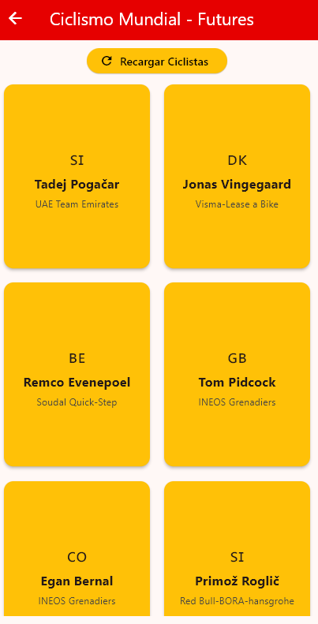 | 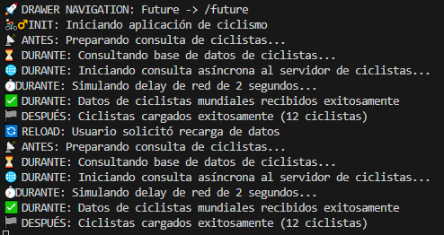 |
| **⏳ Loading State** | **✅ Datos de Ciclistas** | **📊 Logs de Async/Await** |

**Funcionalidad demostrada:**
- ✅ Carga asíncrona con `Future.delayed()`
- ✅ Estados de UI: loading → success
- ✅ Simulación de obtención de datos desde servidor
- ✅ Manejo de errores y logs detallados

### ⏱️ **2. Timer - Cronómetro de Precisión**

| Cronómetro Iniciado | Cronómetro Pausado | Cronómetro Reiniciado | Logs en Consola |
|:---:|:---:|:---:|:---:|
| 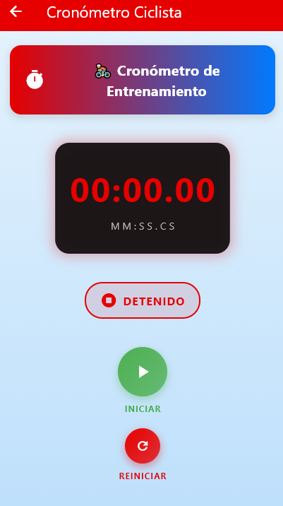 | 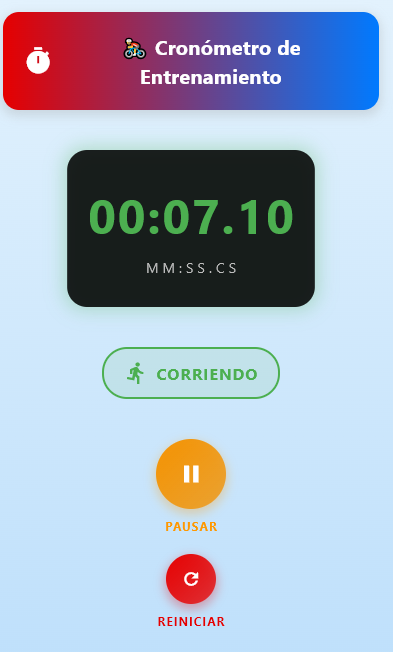 | 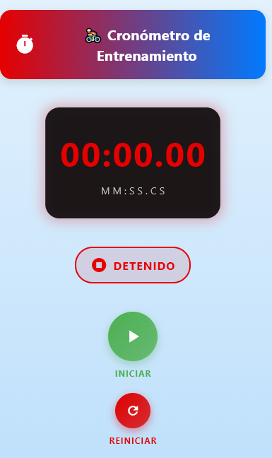 | 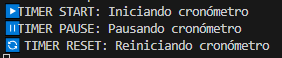 |
| **▶️ Estado: Ejecutando** | **⏸️ Estado: Pausado** | **🔄 Estado: Reiniciado** | **📊 Logs de Timer** |

**Funcionalidad demostrada:**
- ✅ Timer.periodic con actualización cada 100ms
- ✅ Control completo: Iniciar/Pausar/Reanudar/Resetear
- ✅ Formato de tiempo preciso (HH:MM:SS)
- ✅ Gestión de recursos con dispose()

### � **3. Isolate - Procesamiento Pesado Sin Bloquear UI**

| Estado Inicial | Procesamiento en Isolate | Logs en Consola |
|:---:|:---:|:---:|
| 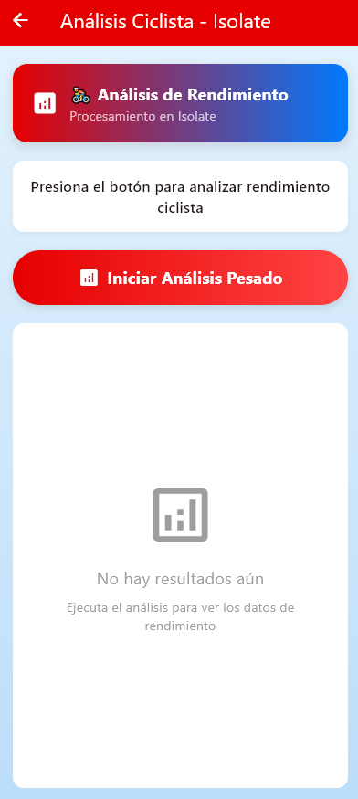 | 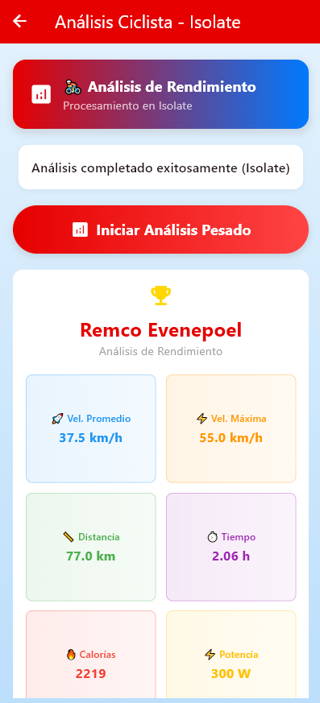 | 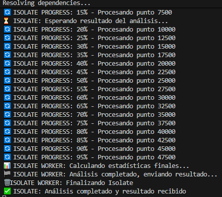 |
| **� Listo para procesar** | **⚙️ Análisis de 50,000 datos** | **📊 Logs de Isolate** |

**Funcionalidad demostrada:**
- ✅ Procesamiento pesado sin bloquear UI principal
- ✅ Comunicación bidireccional (SendPort/ReceivePort)
- ✅ Compatibilidad multiplataforma (Isolate.spawn + compute)
- ✅ Análisis de datos ciclistas en worker thread

## 🎯 **Resultados del Taller**

### ✅ **Objetivos Cumplidos:**
1. **Future/async/await**: Carga asíncrona de datos con estados de UI 
2. **Timer**: Cronómetro funcional con controles completos 
3. **Isolate**: Procesamiento pesado sin bloqueo de UI 
4. **Documentación**: README completo con diagramas y ejemplos 

### 🚀 **Tecnologías Implementadas:**
- **Asincronía**: Future, async/await para operaciones no bloqueantes
- **Temporizadores**: Timer.periodic para cronometraje de precisión
- **Concurrencia**: Isolate.spawn + compute() para procesamiento paralelo
- **UI/UX**: Estados de carga, feedback visual, logs detallados

---

- **Navegación con Paso de Parámetros**:
  - 🔴 **GO**: `context.go()` - Reemplaza toda la pila
  - 🟢 **PUSH**: `context.push()` - Agrega a la pila  
  - 🟣 **REPLACE**: `context.pushReplacement()` - Reemplaza pantalla actual

### 📱 **Pantalla de Detalles (DetailsScreen)**
- Recibe y muestra parámetros de navegación
- **Ciclo de vida visible** en tiempo real en pantalla
- Información del ciclista y estadísticas
- Navegación inteligente según el método usado

### 🔄 **Ciclo de Vida Implementado**
- **`initState()`**: Inicialización del widget
- **`didChangeDependencies()`**: Dependencias disponibles
- **`build()`**: Construcción/reconstrucción de la UI
- **`setState()`**: Notificación de cambio de estado
- **`dispose()`**: Limpieza de recursos

## � Logs en Consola

### 🚀 **Al Navegar** (Ejemplo con GO):
```
🚀=== NAVEGACIÓN CON GO ===
📦 Parámetros siendo pasados:
   • name: 'Santiago Martinez Serna'
   • from: 'go'
🌐 URL completa: '/details?name=Santiago%20Martinez%20Serna&from=go'
⚡ Método: context.go() - Reemplaza toda la pila de navegación
================================
```

### 📥 **Al Recibir Parámetros**:
```
📥=== PARÁMETROS RECIBIDOS EN DETAILS ===
📦 Parámetros decodificados:
   • name: 'Santiago Martinez Serna'
   • from: 'go'
🎯 Método de navegación detectado: GO
=======================================
```

### 🔄 **Ciclo de Vida**:
```
========================================
🟢 DetailsScreen: initState() - Navegado con go
========================================
========================================
🔵 DetailsScreen: didChangeDependencies() - Método: go
========================================
========================================
🟡 DetailsScreen: build() - Construyendo UI para Santiago Martinez Serna
========================================
```

## 🎨 Características de UI/UX

### 🎭 **Diseño**
- **Material Design** con tema personalizado
- **Gradientes** y colores temáticos del ciclismo
- **Responsive** y adaptativo
- **Animaciones** sutiles en botones

### 🧭 **Navegación**
- **Go Router** para navegación declarativa
- **Query Parameters** para paso de datos
- **Navegación inteligente** que detecta el método usado
- **BottomNavigationBar** con opciones adicionales

## ⚙️ Instalación y Ejecución

### 📋 **Requisitos**
- Flutter SDK (>=3.0.0)
- Dart (>=3.0.0)

### 🚀 **Ejecución**
```bash
# Clonar el repositorio
git clone [url-del-repo]
cd mobile_development

# Instalar dependencias
## 🛠️ Tecnologías Utilizadas

- **Flutter**: Framework de desarrollo multiplataforma
- **Dart**: Lenguaje de programación
- **Go Router**: Navegación declarativa
- **Material Design**: Sistema de diseño
- **Isolate**: Concurrencia nativa de Dart
- **Timer**: API nativa para temporizadores

## 🚀 Cómo Ejecutar

```bash
# Clonar el repositorio
git clone [URL_DEL_REPO]

# Navegar al directorio
cd mobile_development

# Obtener dependencias
flutter pub get

# Ejecutar en dispositivo/emulador
flutter run

# Para web específicamente
flutter run -d chrome

# Para Windows
flutter run -d windows
```


---
*Desarrollado por Santiago Martinez - 230222014*
