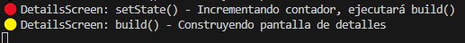
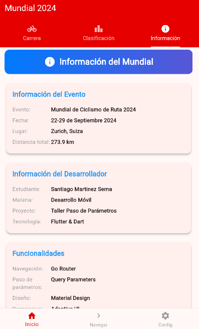
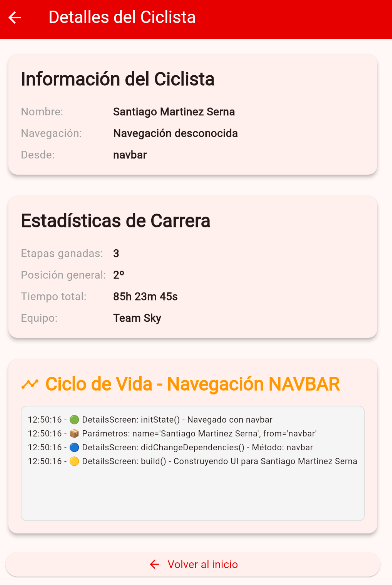
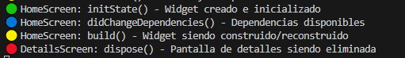

# 🚴‍♂️ Mundial de Ciclismo 2024 - App Flutter

## 📋 Descripción del Proyecto

Aplicación Flutter desarrollada para demostrar **navegación con paso de parámetros** y el **ciclo de vida de widgets** en Flutter. La app simula una aplicación del Mundial de Ciclismo 2024 con diferentes métodos de navegación y seguimiento completo del ciclo de vida.

## 🎯 Objetivos del Taller

### ✅ **Navegación y Paso de Parámetros**
- Implementar diferentes métodos de navegación con **Go Router**
- Demostrar paso de parámetros entre pantallas
- Mostrar diferencias entre `go()`, `push()` y `pushReplacement()`
- Logs detallados en consola del paso de parámetros

### ✅ **Ciclo de Vida de Widgets**
- Implementar y registrar todos los métodos del ciclo de vida
- Mostrar logs tanto en consola como en pantalla
- Demostrar el comportamiento en diferentes tipos de navegación

## 🏗️ Arquitectura del Proyecto

```
lib/
├── main.dart                    # Configuración de la app y router
├── routes/
│   └── app_router.dart         # Configuración de rutas con Go Router
├── views/
│   ├── home/
│   │   └── home_screen.dart    # Pantalla principal con TabBar
│   ├── details/
│   │   └── details_screen.dart # Pantalla de detalles con parámetros
│   └── ciclo_vida/
│       └── ciclo_vida_screen.dart # Pantalla dedicada al ciclo de vida
├── widgets/
│   ├── cyclist_card.dart       # Tarjeta de ciclista
│   ├── stage_button.dart       # Botón de etapa personalizado
│   ├── custom_navbar.dart      # Barra de navegación inferior
│   └── base_view.dart          # Vista base reutilizable
└── themes/
    └── app_theme.dart          # Tema de la aplicación
```

## 🚀 Funcionalidades Implementadas

### 🏠 **Pantalla Principal (HomeScreen)**
- **TabBar** con 3 pestañas:
  - 🚴‍♂️ **Carrera**: Botones de navegación y información del estudiante
  - 🏆 **Clasificación**: Ranking de ciclistas
  - ℹ️ **Información**: Detalles del evento y desarrollador

- **Navegación con Paso de Parámetros**:
  - 🔴 **GO**: `context.go()` - Reemplaza toda la pila
  - 🟢 **PUSH**: `context.push()` - Agrega a la pila  
  - 🟣 **REPLACE**: `context.pushReplacement()` - Reemplaza pantalla actual

### 📱 **Pantalla de Detalles (DetailsScreen)**
- Recibe y muestra parámetros de navegación
- **Ciclo de vida visible** en tiempo real en pantalla
- Información del ciclista y estadísticas
- Navegación inteligente según el método usado

### 🔄 **Ciclo de Vida Implementado**
- **`initState()`**: Inicialización del widget
- **`didChangeDependencies()`**: Dependencias disponibles
- **`build()`**: Construcción/reconstrucción de la UI
- **`setState()`**: Notificación de cambio de estado
- **`dispose()`**: Limpieza de recursos

## � Logs en Consola

### 🚀 **Al Navegar** (Ejemplo con GO):
```
🚀=== NAVEGACIÓN CON GO ===
📦 Parámetros siendo pasados:
   • name: 'Santiago Martinez Serna'
   • from: 'go'
🌐 URL completa: '/details?name=Santiago%20Martinez%20Serna&from=go'
⚡ Método: context.go() - Reemplaza toda la pila de navegación
================================
```

### 📥 **Al Recibir Parámetros**:
```
📥=== PARÁMETROS RECIBIDOS EN DETAILS ===
📦 Parámetros decodificados:
   • name: 'Santiago Martinez Serna'
   • from: 'go'
🎯 Método de navegación detectado: GO
=======================================
```

### 🔄 **Ciclo de Vida**:
```
========================================
🟢 DetailsScreen: initState() - Navegado con go
========================================
========================================
🔵 DetailsScreen: didChangeDependencies() - Método: go
========================================
========================================
🟡 DetailsScreen: build() - Construyendo UI para Santiago Martinez Serna
========================================
```

## 🎨 Características de UI/UX

### 🎭 **Diseño**
- **Material Design** con tema personalizado
- **Gradientes** y colores temáticos del ciclismo
- **Responsive** y adaptativo
- **Animaciones** sutiles en botones

### 🧭 **Navegación**
- **Go Router** para navegación declarativa
- **Query Parameters** para paso de datos
- **Navegación inteligente** que detecta el método usado
- **BottomNavigationBar** con opciones adicionales

## ⚙️ Instalación y Ejecución

### 📋 **Requisitos**
- Flutter SDK (>=3.0.0)
- Dart (>=3.0.0)

### 🚀 **Ejecución**
```bash
# Clonar el repositorio
git clone [url-del-repo]
cd mobile_development

# Instalar dependencias
flutter pub get

# Ejecutar en modo debug
flutter run

# Analizar código
flutter analyze
```

## 🧪 Guía de Pruebas

### 1. **Probar Navegación y Parámetros**
1. Ejecuta la app con `flutter run`
2. En la pestaña "Carrera", prueba los 3 botones:
   - 🔴 "Navegar con GO"
   - 🟢 "Navegar con PUSH" 
   - 🟣 "Navegar con REPLACE"
3. Observa en consola los logs de parámetros
4. Verifica el comportamiento del botón "Volver"

### 2. **Observar Ciclo de Vida**
1. Ve a cualquier pantalla de detalles
2. Observa los logs del ciclo de vida en:
   - **Consola**: Para desarrollo/debug
   - **Pantalla**: En la sección "Ciclo de Vida"
3. Prueba navegar de vuelta para ver `dispose()`

### 3. **Navegación desde Otras Fuentes**
1. Usa la **barra de navegación inferior**
2. Prueba el botón "Navegar" (ítem 2)
3. Verifica que también muestra logs de parámetros

## 📊 Tecnologías Utilizadas

- **Flutter** (>=3.24.5)
- **Dart** (>=3.5.4)
- **go_router** (^14.8.1) - Navegación declarativa
- **Material Design 3** - Sistema de diseño

## 👨‍💻 Desarrollador

**Santiago Martinez Serna**  
🎓 Ingeniería de Sistemas  
📚 Desarrollo Móvil - 7° Semestre

---


## 📸 Galería de Capturas

### 🏠 **Pantallas Principales de la App**

| Inicio | Clasificación | Información |
|:---:|:---:|:---:|
|  <br> **🚴‍♂️ Pantalla Principal** |  <br> **🏆 Tab Clasificación** |  <br> **ℹ️ Tab Información** |

### 🧭 **Navegación desde Barra Inferior**

| Navegación NavBar | Consola NavBar |
|:---:|:---:|
|  <br> **📱 Barra de Navegación** |  <br> **📊 Logs de NavBar** |

### 🚀 **Métodos de Navegación con Paso de Parámetros**

#### 🔴 **Navegación con GO**
| Pantalla Destino | Logs en Consola |
|:---:|:---:|
|  <br> **context.go()** |  <br> **📦 Parámetros GO** |

#### 🟢 **Navegación con PUSH**
| Pantalla Destino | Logs en Consola |
|:---:|:---:|
|  <br> **context.push()** |  <br> **📦 Parámetros PUSH** |

#### 🟣 **Navegación con REPLACE**
| Pantalla Destino | Logs en Consola |
|:---:|:---:|
|  <br> **context.pushReplacement()** |  <br> **📦 Parámetros REPLACE** |


---

**📅 Fecha**: Septiembre 2025  
**🏫 Institución**: Unidad Central del Valle 
**📚 Curso**: Desarrollo Móvil  
**🎯 Proyecto**: Taller Paso de Parámetros y Ciclo de Vida
