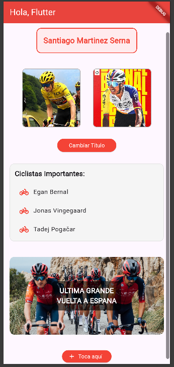
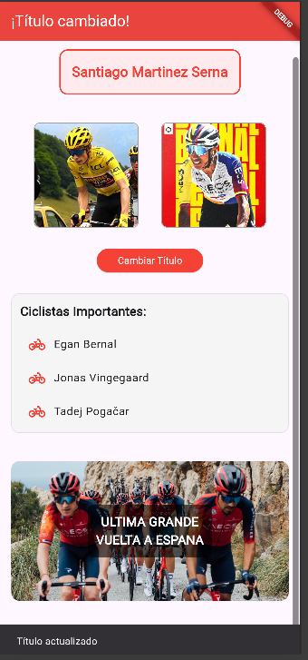
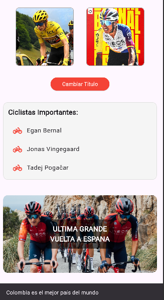

## Taller 1 - Resumen de Implementación

### 📸 Capturas de la Aplicación

| Estado Inicial | Tras cambiar el título | Widgets adicionales |
| -------------- | ---------------------- | ------------------- |
|  |  |  |

Descripción breve:
- En la primera captura se muestra el AppBar con el título por defecto y el nombre del estudiante.
- En la segunda se ve el título alternado mediante `setState()` y el SnackBar (no capturado, pero ocurre al presionar el botón).
- En la tercera se aprecian los widgets extra: `ListView`, `Stack` con texto superpuesto e `ElevatedButton.icon`.

> Si los nombres de archivo cambian, actualiza las rutas en esta tabla. Coloca las imágenes en la raíz del proyecto o dentro de una carpeta (por ejemplo `docs/` o `assets/screenshots/`) y ajusta las rutas.

Esta aplicación Flutter cumple los requisitos solicitados para la pantalla principal (HomePage):

1. AppBar dinámica con título inicial "Hola, Flutter" que alterna a "¡Título cambiado!" mediante `setState()`.
2. Texto centrado mostrando el nombre completo del estudiante: `Santiago Martinez Serna`.
3. Fila (`Row`) con dos imágenes:
	- `Image.network()` cargando una imagen remota.
	- `Image.asset()` mostrando una imagen local (debe existir en `assets/images/`).
4. Botón principal (`ElevatedButton`) que cambia el título y muestra un `SnackBar` con el mensaje: "Título actualizado".
5. Widgets adicionales agregados (más de dos requeridos):
	- `Container` (estilos: márgenes, color, borde, padding).
	- `ListView` con elementos e íconos (lista de ciclistas).
	- `Stack` superponiendo texto semitransparente sobre una imagen.
	- `ElevatedButton.icon` extra mostrando un mensaje adicional.
6. Organización visual usando `Column`, `Padding`, `SizedBox`, `Row`, `ClipRRect` y alineaciones apropiadas.

### 📂 Estructura de Assets
Asegurarse de colocar la imagen local (por ejemplo `local_photo.jpg`) en:
```
assets/images/
```
Declarada en `pubspec.yaml` dentro de la sección `flutter: assets:`.

### ▶️ Ejecución
```
flutter pub get
flutter run
```

### ℹ️ Notas
- Si la imagen local no existe, se muestra un placeholder de error.
- El SnackBar confirma visualmente cada cambio de título.

---
Autor: Santiago Martinez Serna - 230222014
