## Taller 2 - Navegación y Widgets Avanzados

### 📋 Requisitos Implementados

#### 1. ✅ Navegación y paso de parámetros
- **go_router** implementado para navegación
- **Paso de parámetros** desde pantalla principal a pantalla secundaria (nombre y método de navegación)
- **Diferencias demostradas**:
  - `go()`: Reemplaza toda la pila de navegación (sin botón atrás automático)
  - `push()`: Agrega a la pila (mantiene botón atrás)
  - `pushReplacement()`: Reemplaza pantalla actual (sin regreso a la anterior)

#### 2. ✅ Widgets implementados
- **GridView**: 8 elementos con colores diferentes y animaciones
- **TabBar**: 3 pestañas (Inicio, Grid, Info) con contenido diferente
- **BottomNavigationBar**: Navegación adicional (widget extra elegido)
- **Stack**: Texto superpuesto sobre imagen en pantalla secundaria

#### 3. ✅ Ciclo de vida registrado
Todos los métodos registran en consola con comentarios explicativos:
- `initState()`: Inicialización una sola vez
- `didChangeDependencies()`: Dependencias disponibles
- `build()`: Construcción/reconstrucción del widget
- `setState()`: Notificación de cambio de estado
- `dispose()`: Limpieza de recursos

### 📱 Estructura del Proyecto
```
lib/
├── main.dart                 # Configuración go_router y app principal
└── screens/
    ├── home_screen.dart      # Pantalla principal con TabBar y widgets
    └── details_screen.dart   # Pantalla secundaria con parámetros
```

### 🔍 Características Destacadas

**Pantalla Principal (HomeScreen):**
- TabBar con 3 secciones diferentes
- GridView colorido con 8 elementos
- BottomNavigationBar funcional
- Botones para demostrar diferentes tipos de navegación
- Logs del ciclo de vida en consola

**Pantalla Secundaria (DetailsScreen):**
- Recibe y muestra parámetros de navegación
- Stack con imagen y texto superpuesto
- Explicación visual de diferencias de navegación
- Contador con setState() para demostrar ciclo de vida

### 🖥️ Logs de Consola Esperados
Al ejecutar la app verás en consola:
```
🟢 HomeScreen: initState() - Widget creado e inicializado
🔵 HomeScreen: didChangeDependencies() - Dependencias disponibles
🟡 HomeScreen: build() - Widget siendo construido/reconstruido
🔴 HomeScreen: setState() - Estado cambiando, se ejecutará build()
🔴 HomeScreen: dispose() - Widget siendo eliminado, limpiando recursos
```

### ▶️ Ejecución
```bash
flutter pub get
flutter run
```

### 🎯 Funcionalidades de Prueba
1. **Cambiar título**: Botón que alterna AppBar y muestra logs de setState()
2. **Navegación GO**: Sin botón atrás automático
3. **Navegación PUSH**: Con botón atrás
4. **Navegación REPLACE**: Reemplaza pantalla actual
5. **TabBar**: Cambiar entre pestañas
6. **GridView**: Visualizar elementos coloridos
7. **BottomNavigation**: Navegar desde la barra inferior

---
**Autor**: Santiago Martinez Serna  
**Taller**: Navegación y Widgets Avanzados con Flutter

## 📷 Capturas (galería)

### Vista previa (miniaturas)

| Inicio | go() (destino) | go() (consola) |
|---:|:---:|:---:|
| 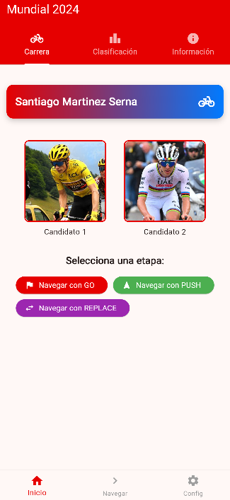 <br> Inicio | 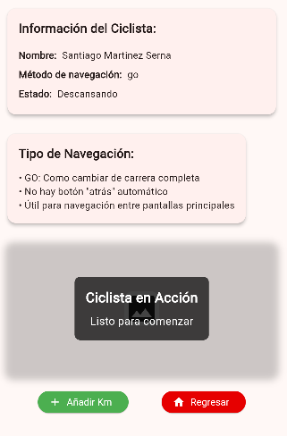 <br> go() | 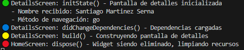 <br> Consola |

| Añadir KM | Consola (Añadir KM) | Regresar |
|:---:|:---:|:---:|
| 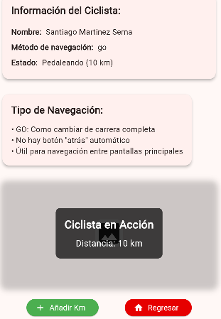 <br> Añadir KM | 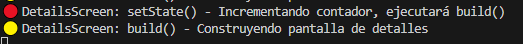 <br> Consola | 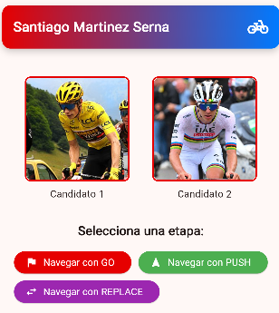 <br> Regresar |

| push() (destino) | push() (consola) | push() - interacción |
|:---:|:---:|:---:|
| 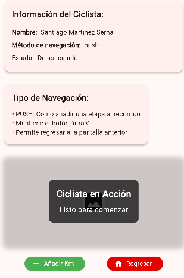 <br> push() | 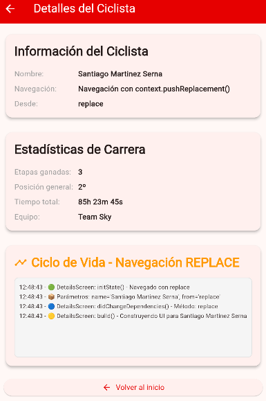 <br> Consola | 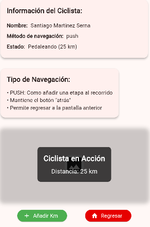 <br> Añadir KM |

| replace (destino) | replace (consola) | intentar regresar tras replace |
|:---:|:---:|:---:|
| 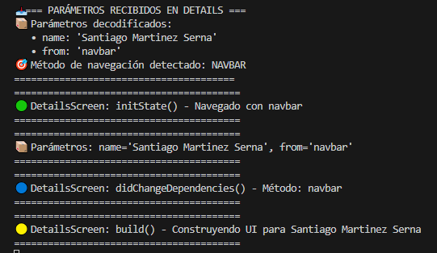 <br> pushReplacement() | 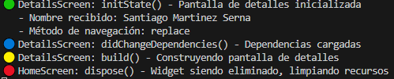 <br> Consola |  <br> No volver |


---
Autor: Santiago Martinez Serna - 230222014
