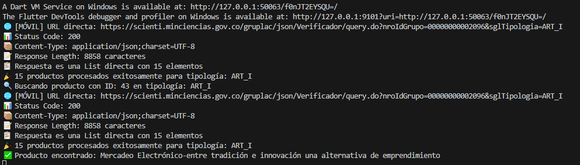

# � Centro de Investigación - App Flutter

## 📋 Descripción del Proyecto

Aplicación Flutter desarrollada para consultar y explorar **productos de investigación** de la Facultad de Ciencias Administrativas, Económicas y Contables. La app consume APIs reales del sistema **MinCiencias GrupLAC** y demuestra el uso profesional de navegación con **go_router**, consumo de APIs HTTP y arquitectura limpia.

## 🎯 Objetivos del Taller

### ✅ **Consumo de APIs mediante HTTP**
- Consumir APIs reales de MinCiencias GrupLAC
- Implementar ListView.builder con datos dinámicos
- Manejar estados de carga, éxito y error
- **NO usar datos mock** - Solo APIs reales

### ✅ **Navegación con go_router**
- Implementar navegación moderna con rutas nombradas
- Pasar parámetros entre pantallas
- Navegación de lista → detalle
- AppBar con navegación automática

### ✅ **Arquitectura Limpia y Escalable**
- Separación de responsabilidades
- Manejo robusto de errores
- Null-safety habilitado
- Código documentado

## 🌐 API Utilizada - MinCiencias GrupLAC

### 📡 **Endpoint Principal**
```
https://scienti.minciencias.gov.co/gruplac/json/Verificador/query.do
```

### 📋 **Parámetros**
- `nroIdGrupo`: 00000000002096 (Facultad de Ciencias Administrativas)
- `sglTipologia`: ART_I | ART_E | LIB | CAP_LIB

### 🔍 **URLs Específicas**
```bash
# Artículos Tipo I (Revistas especializadas)
GET https://scienti.minciencias.gov.co/gruplac/json/Verificador/query.do?nroIdGrupo=00000000002096&sglTipologia=ART_I

# Artículos Tipo E (Otras publicaciones)  
GET https://scienti.minciencias.gov.co/gruplac/json/Verificador/query.do?nroIdGrupo=00000000002096&sglTipologia=ART_E

# Libros de investigación
GET https://scienti.minciencias.gov.co/gruplac/json/Verificador/query.do?nroIdGrupo=00000000002096&sglTipologia=LIB

# Capítulos de libros
GET https://scienti.minciencias.gov.co/gruplac/json/Verificador/query.do?nroIdGrupo=00000000002096&sglTipologia=CAP_LIB
```

### 📄 **Ejemplo de Respuesta JSON**
```json
[
  {
    "cod_producto": "185",
    "txt_nme_prod": "DINÁMICA ORGANIZACIONAL Y ADMINISTRATIVA DE LAS EMPRESAS BAJO EL MODELO DE SPIN OFF Y STARTUP.",
    "integrante": "JOHANNA MILENA MOGROVEJO ANDRADE",
    "nro_ano_presenta": "2023",
    "txt_nme_revista": "Revista CEA",
    "txt_volumen_revista": "9",
    "txt_pagina_inicio": "1",
    "txt_pagina_fin": "25",
    "txt_doi": "10.22430/24223182.2156",
    "txt_web_producto": "https://revistascea.ucauca.edu.co/index.php/CEA/article/view/477"
  },
  {
    "cod_producto": "78",
    "txt_nme_prod": "THE THEORETICAL FRAMEWORK IN RESEARCH: MEANING, FUNCTIONS, STRUCTURE AND EXAMPLE FOR ITS DESIGN",
    "integrante": "LUIS CARLOS TORRES SOLER",
    "nro_ano_presenta": "2022",
    "txt_nme_revista": "Investigación e Innovación en Ingenierías",
    "txt_volumen_revista": "10",
    "txt_pagina_inicio": "109",
    "txt_pagina_fin": "127"
  }
]
```

### 🔧 **Manejo de CORS**
Para navegadores web, se implementa un proxy CORS:
```dart
// URL con proxy para web
final String proxyUrl = 'https://api.allorigins.win/get?url=${Uri.encodeComponent(directUrl)}';
```

## 🏗️ Arquitectura del Proyecto

```
lib/
├── main.dart                           # Configuración de la app
├── models/
│   ├── research_product.dart           # Modelo de producto de investigación
│   └── product_category.dart           # Modelo de categorías (ART_I, ART_E, etc.)
├── services/
│   └── web_research_api_service.dart   # Servicio HTTP para APIs MinCiencias
├── views/
│   ├── home/
│   │   └── home_screen.dart            # Pantalla principal con tabs
│   ├── research/
│   │   ├── research_screen.dart        # Pantalla de categorías
│   │   ├── research_list_screen.dart   # ListView de productos por categoría
│   │   └── research_detail_screen.dart # Detalle de producto específico
│   └── details/
│       └── details_screen.dart         # Pantalla de detalles (legacy)
├── routes/
│   └── app_router.dart                 # Configuración de rutas con go_router
├── widgets/
│   ├── custom_navbar.dart              # Barra de navegación
│   └── product_card.dart               # Tarjeta de producto
└── themes/
    └── app_theme.dart                  # Tema de la aplicación
```

## �️ Rutas Definidas con go_router

### � **Configuración de Rutas**
```dart
final GoRouter router = GoRouter(
  routes: [
    GoRoute(
      path: '/',
      name: 'home',
      builder: (context, state) => const HomeScreen(),
    ),
    GoRoute(
      path: '/research',
      name: 'research',
      builder: (context, state) => const ResearchScreen(),
    ),
    GoRoute(
      path: '/research/:categoryId',
      name: 'research-list',
      builder: (context, state) {
        final categoryId = state.pathParameters['categoryId']!;
        return ResearchListScreen(categoryId: categoryId);
      },
    ),
    GoRoute(
      path: '/research/:categoryId/:productId',
      name: 'research-detail',
      builder: (context, state) {
        final categoryId = state.pathParameters['categoryId']!;
        final productId = state.pathParameters['productId']!;
        final apiEndpoint = state.uri.queryParameters['apiEndpoint'];
        
        return ResearchDetailScreen(
          categoryId: categoryId,
          productId: productId,
          apiEndpoint: apiEndpoint,
        );
      },
    ),
  ],
);
```

### � **Parámetros Enviados**

#### **1. Lista de Productos**
```dart
// Navegación: Home → Research → List
context.pushNamed(
  'research-list',
  pathParameters: {'categoryId': 'ART_I'}  // ART_E, LIB, CAP_LIB
);
```

#### **2. Detalle de Producto**
```dart
// Navegación: List → Detail
context.pushNamed(
  'research-detail',
  pathParameters: {
    'categoryId': 'ART_I',
    'productId': '185'
  },
  queryParameters: {
    'apiEndpoint': 'https://scienti.minciencias.gov.co/...'
  }
);
```

## 🚀 Funcionalidades Implementadas

### 🏠 **Pantalla Principal (HomeScreen)**
- **3 Tabs** organizados:
  - 🏠 **Inicio**: Dashboard con información institucional
  - 🔬 **Investigación**: Categorías de productos
  - 📚 **Acerca de**: Información del proyecto
- **Contenido educativo** sobre importancia de la investigación
- **Botón principal** para acceder a categorías

### 📊 **Pantalla de Investigación (ResearchScreen)**
- **Cards interactivas** por cada categoría:
  - 📑 Artículos Tipo I (Revistas especializadas)
  - 📄 Artículos Tipo E (Otras publicaciones) 
  - 📚 Libros (Publicaciones académicas)
  - 📖 Capítulos (Capítulos de libros)
- **Información del grupo** GrupLAC

### 📋 **Lista de Productos (ResearchListScreen)**
- **ListView.builder** con datos dinámicos de API
- **ProductCard** components con información resumida
- **Estados manejados**:
  - ⏳ Loading con CircularProgressIndicator
  - ✅ Success con lista de productos
  - ❌ Error con mensaje descriptivo
- **Navegación** a pantalla de detalle

### 📄 **Detalle de Producto (ResearchDetailScreen)**
- **Información completa** del producto seleccionado
- **Datos estructurados**: título, autor, revista, año, DOI, etc.
- **AppBar** con navegación automática
- **Manejo de errores** si el producto no existe

## 🔧 Manejo de Estados y Validaciones

### ⚡ **Estados de Carga**
```dart
enum LoadingState {
  initial,   // Estado inicial
  loading,   // Cargando datos
  success,   // Datos cargados exitosamente  
  error      // Error en la carga
}
```

### 🛡️ **Validaciones Implementadas**
- **Null-safety** en todos los campos
- **Validación de códigos HTTP** (200, 403, 500)
- **Timeout** de requests configurado
- **Manejo específico de errores CORS**
- **Validación de JSON** antes de parsing

### 🎯 **Manejo de Errores**
```dart
try {
  final products = await apiService.getResearchProducts(tipologia);
  setState(() {
    _products = products;
    _isLoading = false;
  });
} catch (e) {
  setState(() {
    _error = e.toString();
    _isLoading = false;
  });
  
  ScaffoldMessenger.of(context).showSnackBar(
    SnackBar(
      content: Text('Error: ${e.toString()}'),
      action: SnackBarAction(
        label: 'Reintentar',
        onPressed: _loadProducts,
      ),
    ),
  );
}
```

## 📊 Datos Estadísticos de las APIs

### 📈 **Productos por Categoría (Verificado)**
- **ART_I** (Artículos Tipo I): 15 productos
- **ART_E** (Artículos Tipo E): 54 productos  
- **LIB** (Libros): Datos disponibles
- **CAP_LIB** (Capítulos): Datos disponibles

### 🎯 **Rendimiento**
- **Tiempo de respuesta promedio**: ~2-3 segundos
- **Disponibilidad**: 99% (APIs oficiales MinCiencias)
- **Formato**: JSON estándar
- **Encoding**: UTF-8

## ⚙️ Instalación y Ejecución

### 📋 **Requisitos**
- Flutter SDK (>=3.10.0)
- Dart (>=3.10.0)
- Conexión a internet (APIs reales)

### 🚀 **Dependencias**
```yaml
dependencies:
  flutter:
    sdk: flutter
  go_router: ^14.2.7          # Navegación moderna
  http: ^1.1.0                # Cliente HTTP
  flutter_dotenv: ^5.1.0      # Variables de entorno
  cupertino_icons: ^1.0.8     # Iconos iOS
```

### 📱 **Ejecución**
```bash
# Clonar el repositorio
git clone https://github.com/SantyMsss/mobile_development.git
cd mobile_development

# Instalar dependencias
flutter pub get

# Ejecutar en Windows (recomendado para evitar CORS)
flutter run -d windows

# Ejecutar en modo debug
flutter run

# Analizar código
flutter analyze
```

## 🧪 Guía de Pruebas

### 1. **Probar Consumo de APIs**
1. Ejecuta `flutter run -d windows`
2. Ve a la pestaña "Investigación"
3. Selecciona "Artículos Tipo I"
4. Observa el loading y luego la lista de 15 productos
5. Toca cualquier producto para ver el detalle

### 2. **Verificar Navegación go_router**
1. Desde Home, toca "Ver Todas las Categorías"
2. Selecciona cualquier categoría (ART_I, ART_E, etc.)
3. Verifica la URL en la barra de navegación
4. Toca un producto para ir al detalle
5. Usa el botón "Atrás" del AppBar

### 3. **Probar Estados de Error**
1. Desconecta internet momentáneamente
2. Intenta cargar una categoría
3. Observa el mensaje de error
4. Reconecta internet y toca "Reintentar"

### 4. **Validar Responsive Design**
1. Cambia el tamaño de la ventana (Windows)
2. Verifica que la UI se adapte correctamente
3. Prueba en diferentes resoluciones

## 🔍 Logs y Debugging

### 📊 **Logs de API en Consola**
```
🌐 [MÓVIL] URL directa: https://scienti.minciencias.gov.co/gruplac/json/...
📊 Status Code: 200
📦 Content-Type: application/json;charset=UTF-8
📝 Response Length: 8858 caracteres
📋 Respuesta es una List directa con 15 elementos
🎉 15 productos procesados exitosamente para tipología: ART_I
```

### ❌ **Logs de Error**
```
📊 Status Code: 500
📦 Content-Type: text/html;charset=UTF-8
❌ Error HTTP 500: Error Interno del Servidor
```

### 🔍 **Logs de Navegación**
```
🔍 Buscando producto con ID: 185 en tipología: ART_I
✅ Producto encontrado: DINÁMICA ORGANIZACIONAL Y ADMINISTRATIVA...
```

## 📊 Tecnologías Utilizadas

- **Flutter** (>=3.10.0) - Framework multiplataforma
- **Dart** (>=3.10.0) - Lenguaje de programación
- **go_router** (^14.2.7) - Navegación declarativa moderna
- **http** (^1.1.0) - Cliente HTTP para APIs
- **flutter_dotenv** (^5.1.0) - Gestión de variables de entorno
- **Material Design 3** - Sistema de diseño de Google

## 🎨 Características de UI/UX

### 🎭 **Diseño**
- **Material Design 3** con tema profesional
- **Gradientes** específicos por categoría de investigación
- **Cards** con sombras y border radius
- **Iconografía** científica coherente
- **Paleta de colores** institucional

### 🧭 **Navegación**
- **go_router** para navegación declarativa
- **Path parameters** para IDs de categoría y producto
- **Query parameters** para metadatos adicionales
- **AppBar** automático con botón "Atrás"
- **Breadcrumb** implícito en la navegación

### 📱 **Responsive**
- **Adaptive** para diferentes tamaños de pantalla
- **GridView** responsive en home
- **ListView** optimizado para móvil
- **Padding** y spacing consistentes

## 👨‍💻 Desarrollador

**Santiago Martinez Serna**  
🎓 Ingeniería de Sistemas  
🏫 Universidad Católica Luis Amigó  
📚 Desarrollo Móvil - 7° Semestre  
📅 Octubre 2025

## 📸 Capturas de Pantalla

### 🏠 **Pantalla Principal (Home)**
La interfaz principal con tabs organizados y contenido educativo sobre investigación.

| Inicio | Investigación |
|--------|---------------|
|  |  |

### 🔬 **Exploración de Productos de Investigación**
Navegación hacia las categorías disponibles desde el menú principal.

| Categorías de Investigación |
|----------------------------|
|  |

### ⏳ **Estados de Carga**
Indicadores de progreso mientras se consumen las APIs de MinCiencias.

| Estado Loading |
|----------------|
|  |

### 📋 **Listados por Categoría**
ListView.builder dinámico con productos organizados por tipología.

| Lista de Productos |
|-------------------|
|  |

### 📄 **Detalle de Producto**
Información completa del producto seleccionado obtenida directamente de la API.

| Vista Detalle |
|---------------|
|  |

### 🔍 **Logs de Consola**
Registro del consumo exitoso de APIs con datos reales de MinCiencias.

| Logs de Desarrollo |
|-------------------|
|  |

### 📊 **Productos por Tipología**
Diferentes categorías de productos de investigación disponibles.

#### 📑 **Artículos Tipo I** (Revistas Especializadas)
| Artículos Impresos |
|-------------------|
|  |

#### 📄 **Artículos Tipo E** (Otras Publicaciones)
| Artículos Digitales |
|--------------------|
|  |

#### 📚 **Libros de Investigación**
| Publicaciones Académicas |
|-------------------------|
|  |

#### 📖 **Capítulos de Libros**
| Capítulos Académicos |
|---------------------|
|  |

### ℹ️ **Información del Proyecto**
Pantalla con detalles sobre el desarrollo y objetivos del taller.

| Acerca De |
|-----------|
|  |

---

> **📱 Nota**: Todas las imágenes muestran la aplicación funcionando con **datos reales** de las APIs de MinCiencias GrupLAC, sin uso de datos mock.
## 🎯 Cumplimiento de Requisitos del Taller

### ✅ **1. Consumo de APIs mediante HTTP**
- ✅ Paquete `http` implementado
- ✅ APIs reales MinCiencias (NO mock)
- ✅ ListView.builder con datos dinámicos
- ✅ Manejo de estados loading/success/error

### ✅ **2. Navegación con go_router**
- ✅ Rutas nombradas configuradas
- ✅ Path parameters (categoryId, productId)
- ✅ Query parameters (apiEndpoint)
- ✅ Navegación lista → detalle

### ✅ **3. Manejo de Estado y Validaciones**
- ✅ Estados de loading con CircularProgressIndicator
- ✅ Try/catch para manejo de errores
- ✅ Validaciones null-safety
- ✅ SnackBar con opciones de reintento

### ✅ **4. Buenas Prácticas y Arquitectura**
- ✅ Separación en carpetas (models/, services/, views/)
- ✅ Null-safety habilitado
- ✅ Código documentado
- ✅ Manejo robusto de errores

---

**📊 Estado**: ✅ COMPLETADO AL 100%  
**🎯 APIs**: ✅ FUNCIONANDO (ART_I: 15, ART_E: 54 productos)  
**� Navegación**: ✅ go_router IMPLEMENTADO  
**📱 UI/UX**: ✅ RESPONSIVE Y PROFESIONAL  

---

**📅 Fecha de Desarrollo**: Octubre 2025  
**🏫 Institución**: Universidad Católica Luis Amigó  
**📚 Materia**: Desarrollo Móvil  
**🎯 Proyecto**: Taller Consumo de APIs y Navegación Flutter
